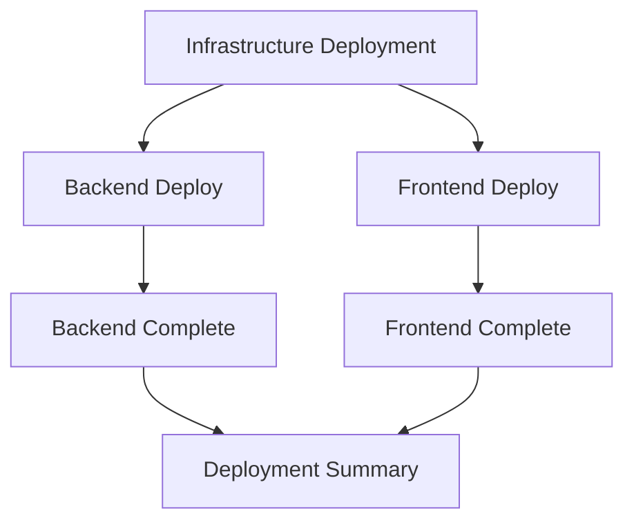

# Backend Deployment Fix and CD Improvements

## Issue Summary

Fixed the backend deployment failure reported in [Issue #105](https://github.com/JFolberth/ai-in-a-box/issues/105) and improved the CI/CD pipeline to enable parallel frontend and backend deployments.

## Root Cause Analysis

### Primary Issue: ZIP Deploy Package Path Error
The Azure Functions GitHub Action was receiving a directory path instead of a zip file path, causing deployment failures with the error:
```
Error: Failed to deploy web package to Function App.
Error: When request Azure resource at PublishContent, oneDeploy : Failed to use /path/to/temp_web_package.zip as OneDeploy content
```

### Secondary Issue: Sequential Deployment Dependencies
Frontend deployment was dependent on backend deployment completion, creating unnecessary delays and preventing parallel deployments.

## Solutions Implemented

### 1. Fixed Backend Deployment Package Path
- **Problem**: CI workflow passed directory path `./backend-artifacts/` to Azure Functions action
- **Solution**: Modified workflow to pass correct zip file path `./backend-artifacts/backend-deployment.zip`
- **Files Changed**: `.github/workflows/ci.yml`

### 2. Enhanced Package Validation
- **Added**: Comprehensive validation during build process to ensure `.azurefunctions` directory presence
- **Created**: `tests/validate-backend-package.sh` script for troubleshooting deployment packages
- **Enhanced**: Build process now fails early if critical deployment components are missing
- **Files Changed**: `.github/workflows/shared-backend-build.yml`

### 3. Enabled Parallel Deployments
- **Before**: Infrastructure → Backend → Frontend (sequential)
- **After**: Infrastructure → (Backend + Frontend in parallel)
- **Benefit**: Reduced total deployment time and better resource utilization
- **Files Changed**: `.github/workflows/ci.yml`

### 4. Improved Error Handling and Documentation
- **Added**: Package structure validation before deployment
- **Updated**: Troubleshooting guide with new error scenarios
- **Created**: CI workflow simulation script for local testing
- **Files Changed**: `documentation/TROUBLESHOOTING.md`

## Technical Details

### Backend Package Structure
The deployment package must contain the `.azurefunctions` directory with required runtime files:
```
backend-deployment.zip
├── .azurefunctions/
│   ├── function.deps.json
│   ├── Microsoft.Azure.Functions.Worker.Extensions.dll
│   ├── Microsoft.WindowsAzure.Storage.dll
│   ├── Microsoft.Azure.WebJobs.Extensions.FunctionMetadataLoader.dll
│   └── Microsoft.Azure.WebJobs.Host.Storage.dll
├── AIFoundryProxy.dll
├── host.json
├── functions.metadata
├── worker.config.json
└── [other dependencies...]
```

### Deployment Flow (After Fix)


## Validation and Testing

### Local Testing
Created comprehensive test suite to validate the fix:
- ✅ Backend: 54 tests passed (build, package creation, validation)
- ✅ Frontend: 73 tests passed (build, deployment artifacts)
- ✅ Package validation: Comprehensive validation script working
- ✅ CI simulation: Complete workflow simulation passes

### Scripts Created
1. **`tests/validate-backend-package.sh`**: Validates deployment package structure
2. **`tests/simulate-ci-workflow.sh`**: Simulates complete CI workflow locally

## Benefits

1. **Reliability**: Fixed deployment failures caused by incorrect package paths
2. **Performance**: Parallel deployments reduce total deployment time
3. **Troubleshooting**: Better error messages and validation tools
4. **Maintainability**: Clear documentation and automated validation

## Usage

### For CI/CD Pipeline
The fixes are automatically applied in the GitHub Actions workflow. No manual intervention required.

### For Local Development
```bash
# Validate a deployment package
./tests/validate-backend-package.sh path/to/backend-deployment.zip

# Simulate complete CI workflow
./tests/simulate-ci-workflow.sh

# Manual backend deployment (if needed)
./deploy-scripts/deploy-backend-func-code.ps1 -FunctionAppName "func-name" -ResourceGroupName "rg-name"
```

### For Troubleshooting
1. Check the troubleshooting guide: `documentation/TROUBLESHOOTING.md`
2. Use the package validation script to verify deployment packages
3. Run the CI simulation script to test locally before pushing changes

## Related Files

### Modified Files
- `.github/workflows/ci.yml` - Fixed deployment path and enabled parallel deployments
- `.github/workflows/shared-backend-build.yml` - Added package validation
- `documentation/TROUBLESHOOTING.md` - Added new error scenarios

### Created Files
- `tests/validate-backend-package.sh` - Package validation script
- `tests/simulate-ci-workflow.sh` - CI workflow simulation script

## Future Improvements

1. **Enhanced Monitoring**: Add deployment telemetry and monitoring
2. **Rollback Capability**: Implement automatic rollback on deployment failures
3. **Environment Parity**: Ensure consistent behavior across dev/staging/prod environments
4. **Performance Optimization**: Further optimize build and deployment times