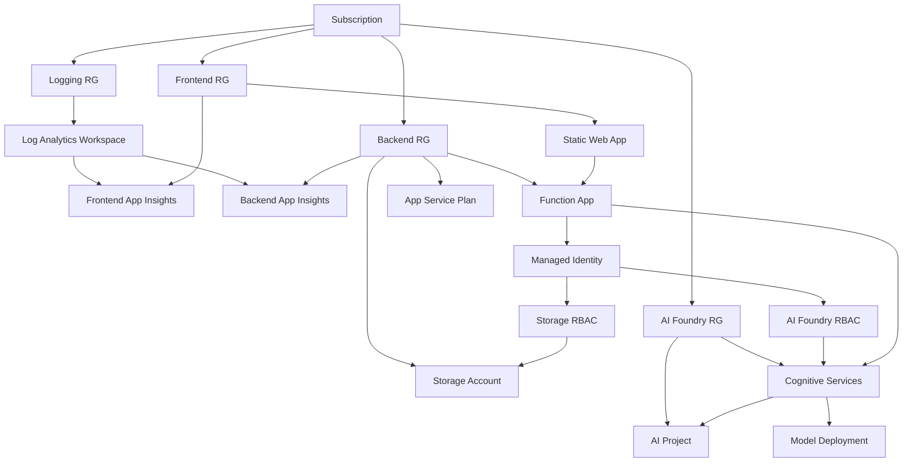
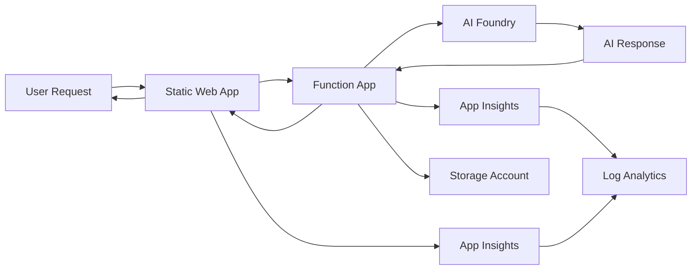

# Resource Architecture Diagrams

This document provides visual representations of the AI in A Box resource architecture, showing all components, relationships, and deployment scenarios.

## 🎯 Overview

The AI in A Box infrastructure supports three deployment scenarios with different combinations of new and existing resources. Each scenario maintains the same core architecture while varying the infrastructure ownership.

## 🏗️ Core Architecture Components

### High-Level Multi-Resource Group Architecture

```
┌─────────────────────────────────────────────────────────────────────────────────────┐
│                                Azure Subscription                                   │
├─────────────────────────────────────────────────────────────────────────────────────┤
│                                                                                     │
│  ┌─────────────────────────────┐    ┌─────────────────────────────────────────────┐ │
│  │   Frontend Resource Group   │    │        Backend Resource Group              │ │
│  │   rg-app-frontend-env-reg   │    │        rg-app-backend-env-reg              │ │
│  │                             │    │                                           │ │
│  │  ┌─────────────────────────┐ │    │  ┌─────────────────────────────────────┐  │ │
│  │  │    Static Web App       │ │    │  │         Function App              │  │ │
│  │  │  stapp-app-frontend...  │ │────┼──┼──→      func-app-backend...        │  │ │
│  │  │    (SPA Hosting)        │ │    │  │      (AI Foundry Proxy)           │  │ │
│  │  └─────────────────────────┘ │    │  └─────────────────────────────────────┘  │ │
│  │                             │    │                                           │ │
│  │  ┌─────────────────────────┐ │    │  ┌─────────────────────────────────────┐  │ │
│  │  │   Application Insights  │ │    │  │         Storage Account            │  │ │
│  │  │   appi-app-frontend...  │ │    │  │       st{appbackendenvrag}          │  │ │
│  │  │    (Frontend Monitoring)│ │    │  │      (Function Storage)             │  │ │
│  │  └─────────────────────────┘ │    │  └─────────────────────────────────────┘  │ │
│  └─────────────────────────────┘    │                                           │ │
│                                     │  ┌─────────────────────────────────────┐  │ │
│                                     │  │      App Service Plan              │  │ │
│                                     │  │       asp-app-backend...            │  │ │
│                                     │  │    (Flex Consumption)               │  │ │
│                                     │  └─────────────────────────────────────┘  │ │
│                                     │                                           │ │
│                                     │  ┌─────────────────────────────────────┐  │ │
│                                     │  │     Application Insights            │  │ │
│                                     │  │      appi-app-backend...            │  │ │
│                                     │  │     (Backend Monitoring)            │  │ │
│                                     │  └─────────────────────────────────────┘  │ │
│                                     └─────────────────────────────────────────────┘ │
│                                                                                     │
│  ┌─────────────────────────────────────────────────────────────────────────────────┐ │
│  │               Centralized Log Analytics Workspace                               │ │
│  │                    (Scenario A & B: Created | Scenario C: Existing)            │ │
│  │                           la-app-logging-env-reg                                │ │
│  └─────────────────────────────────────────────────────────────────────────────────┘ │
│                                                                                     │
│  ┌─────────────────────────────────────────────────────────────────────────────────┐ │
│  │                       AI Foundry Infrastructure                                 │ │
│  │                    (Scenario A: Created | Scenario B & C: Existing)            │ │
│  │                                                                                 │ │
│  │  ┌─────────────────────────────────────────────────────────────────────────┐   │ │
│  │  │                    Cognitive Services Account                          │   │ │
│  │  │                      cs-app-aifoundry-env-reg                          │   │ │
│  │  │                         (AIServices Kind)                              │   │ │
│  │  │                                                                         │   │ │
│  │  │  ┌─────────────────────────────────────────────────────────────────┐   │   │ │
│  │  │  │                    AI Project                                   │   │   │ │
│  │  │  │              aiproj-app-aifoundry-env-reg                       │   │   │ │
│  │  │  │                                                                 │   │   │ │
│  │  │  │  ┌─────────────────────────────────────────────────────────┐   │   │   │ │
│  │  │  │  │               Model Deployment                          │   │   │   │ │
│  │  │  │  │                gpt-4.1-mini                            │   │   │   │ │
│  │  │  │  │            (100 TPM Capacity)                          │   │   │   │ │
│  │  │  │  └─────────────────────────────────────────────────────────┘   │   │   │ │
│  │  │  └─────────────────────────────────────────────────────────────────┘   │   │ │
│  │  └─────────────────────────────────────────────────────────────────────────┘   │ │
│  └─────────────────────────────────────────────────────────────────────────────────┘ │
│                                                                                     │
└─────────────────────────────────────────────────────────────────────────────────────┘
```

## 📋 Deployment Scenario Architectures

### Scenario A: Complete New Deployment

**Configuration**:
- `createAiFoundryResourceGroup: true`
- `createLogAnalyticsWorkspace: true`

**Resources Created**:
```
🏗️ All New Infrastructure

📂 Resource Groups (4):
├── rg-{app}-frontend-{env}-{region}     ✅ Created
├── rg-{app}-backend-{env}-{region}      ✅ Created  
├── rg-{app}-aifoundry-{env}-{region}    ✅ Created
└── rg-{app}-logging-{env}-{region}      ✅ Created

🌐 Frontend Resources:
├── stapp-{app}-frontend-{env}-{region}  (Static Web App)
└── appi-{app}-frontend-{env}-{region}   (Application Insights)

⚙️ Backend Resources:
├── func-{app}-backend-{env}-{region}    (Function App)
├── st{appbackendenvregion}              (Storage Account)
├── asp-{app}-backend-{env}-{region}     (App Service Plan)
└── appi-{app}-backend-{env}-{region}    (Application Insights)

🤖 AI Foundry Resources:
├── cs-{app}-aifoundry-{env}-{region}    (Cognitive Services)
├── aiproj-{app}-aifoundry-{env}-{region} (AI Project)
└── gpt-4.1-mini                         (Model Deployment)

📊 Logging Resources:
└── la-{app}-logging-{env}-{region}      (Log Analytics Workspace)

🔐 RBAC Assignments:
├── Storage Blob Data Contributor        → Backend RG
├── Azure AI User                        → AI Foundry RG
└── Cognitive Services OpenAI User       → AI Foundry RG
```

### Scenario B: Existing AI Foundry + New Logging

**Configuration**:
- `createAiFoundryResourceGroup: false`
- `createLogAnalyticsWorkspace: true`

**Resources Created**:
```
🏗️ Partial New Infrastructure + Existing AI Foundry

📂 Resource Groups (3 new + 1 existing):
├── rg-{app}-frontend-{env}-{region}     ✅ Created
├── rg-{app}-backend-{env}-{region}      ✅ Created
├── rg-{app}-logging-{env}-{region}      ✅ Created
└── {existing-ai-foundry-rg}             🔗 Existing (Referenced)

🌐 Frontend Resources:
├── stapp-{app}-frontend-{env}-{region}  (Static Web App)
└── appi-{app}-frontend-{env}-{region}   (Application Insights)

⚙️ Backend Resources:
├── func-{app}-backend-{env}-{region}    (Function App)
├── st{appbackendenvregion}              (Storage Account)
├── asp-{app}-backend-{env}-{region}     (App Service Plan)
└── appi-{app}-backend-{env}-{region}    (Application Insights)

🤖 AI Foundry Resources:
├── {existing-cognitive-services}        🔗 Existing (Referenced)
├── {existing-ai-project}                🔗 Existing (Referenced)
└── {existing-model-deployment}          🔗 Existing (Referenced)

📊 Logging Resources:
└── la-{app}-logging-{env}-{region}      (Log Analytics Workspace)

🔐 RBAC Assignments:
├── Storage Blob Data Contributor        → Backend RG
├── Azure AI User                        → Existing AI Foundry RG
└── Cognitive Services OpenAI User       → Existing AI Foundry RG
```

### Scenario C: Use All Existing Resources

**Configuration**:
- `createAiFoundryResourceGroup: false`
- `createLogAnalyticsWorkspace: false`

**Resources Created**:
```
🏗️ Minimal New Infrastructure + All Existing Shared Resources

📂 Resource Groups (2 new + 2 existing):
├── rg-{app}-frontend-{env}-{region}     ✅ Created
├── rg-{app}-backend-{env}-{region}      ✅ Created
├── {existing-ai-foundry-rg}             🔗 Existing (Referenced)
└── {existing-logging-rg}                🔗 Existing (Referenced)

🌐 Frontend Resources:
├── stapp-{app}-frontend-{env}-{region}  (Static Web App)
└── appi-{app}-frontend-{env}-{region}   (Application Insights)

⚙️ Backend Resources:
├── func-{app}-backend-{env}-{region}    (Function App)
├── st{appbackendenvregion}              (Storage Account)
├── asp-{app}-backend-{env}-{region}     (App Service Plan)
└── appi-{app}-backend-{env}-{region}    (Application Insights)

🤖 AI Foundry Resources:
├── {existing-cognitive-services}        🔗 Existing (Referenced)
├── {existing-ai-project}                🔗 Existing (Referenced)
└── {existing-model-deployment}          🔗 Existing (Referenced)

📊 Logging Resources:
└── {existing-log-analytics-workspace}   🔗 Existing (Referenced)

🔐 RBAC Assignments:
├── Storage Blob Data Contributor        → Backend RG
├── Azure AI User                        → Existing AI Foundry RG
└── Cognitive Services OpenAI User       → Existing AI Foundry RG
```

## 🔄 Data Flow and Communication Patterns

### Request Flow Architecture

```
┌─────────────────┐    HTTPS     ┌─────────────────────┐    Managed    ┌─────────────────────┐
│                 │    Request   │                     │   Identity    │                     │
│   Web Browser   │─────────────→│   Static Web App    │               │                     │
│                 │              │                     │               │                     │
└─────────────────┘              └─────────────────────┘               │                     │
                                          │                             │                     │
                                          │ HTTPS API                   │                     │
                                          │ Request                     │                     │
                                          ▼                             │                     │
                                 ┌─────────────────────┐    Authentication   │   AI Foundry        │
                                 │                     │    & API Calls      │   Cognitive         │
                                 │   Function App      │─────────────────────→│   Services          │
                                 │   (AI Proxy)        │                     │                     │
                                 └─────────────────────┘                     │                     │
                                          │                             │                     │
                                          │ Telemetry                   │                     │
                                          ▼                             │                     │
                                 ┌─────────────────────┐                     │                     │
                                 │                     │                     │                     │
                                 │  Application        │                     │                     │
                                 │  Insights           │                     │                     │
                                 │                     │                     │                     │
                                 └─────────────────────┘                     └─────────────────────┘
                                          │
                                          │ Logs & Metrics
                                          ▼
                                 ┌─────────────────────┐
                                 │                     │
                                 │  Log Analytics      │
                                 │  Workspace          │
                                 │                     │
                                 └─────────────────────┘
```

### Security Flow Architecture

```
┌─────────────────────────────────────────────────────────────────────────────────────┐
│                              Azure Active Directory                                 │
├─────────────────────────────────────────────────────────────────────────────────────┤
│                                                                                     │
│  ┌─────────────────────────────────────────────────────────────────────────────┐   │
│  │                        Managed Identity                                     │   │
│  │                                                                             │   │
│  │  Function App System-Assigned Identity                                     │   │
│  │  └── Principal ID: {dynamic-guid}                                          │   │
│  │  └── Token Scope: https://cognitiveservices.azure.com/                    │   │
│  └─────────────────────────────────────────────────────────────────────────────┘   │
│                                         │                                           │
└─────────────────────────────────────────┼───────────────────────────────────────────┘
                                          │ Token Request
                                          ▼
                     ┌─────────────────────────────────────────────┐
                     │            RBAC Validation                  │
                     ├─────────────────────────────────────────────┤
                     │                                             │
                     │ ✅ Azure AI User                            │
                     │    Scope: AI Foundry Resource Group        │
                     │                                             │
                     │ ✅ Cognitive Services OpenAI User          │
                     │    Scope: AI Foundry Resource Group        │
                     │                                             │
                     │ ✅ Storage Blob Data Contributor           │
                     │    Scope: Backend Resource Group           │
                     └─────────────────────────────────────────────┘
                                          │ Access Granted
                                          ▼
                     ┌─────────────────────────────────────────────┐
                     │          Resource Access                    │
                     ├─────────────────────────────────────────────┤
                     │                                             │
                     │ 🤖 AI Foundry API Calls                    │
                     │ 💾 Storage Account Access                   │
                     │ 📊 Telemetry Data Collection               │
                     └─────────────────────────────────────────────┘
```

## 🎯 Resource Dependencies and Relationships

### Deployment Dependencies



### Runtime Dependencies



## 📊 Resource Sizing and Scaling

### Resource Tier Matrix

| Resource Type | Development | Staging | Production |
|---------------|-------------|---------|------------|
| **Static Web App** | Free | Standard | Standard |
| **Function App** | Consumption | Premium | Premium |
| **Storage Account** | Standard_LRS | Standard_GRS | Standard_GRS |
| **App Service Plan** | Flex Consumption | Flex Consumption | Premium |
| **Application Insights** | Basic | Basic | Enterprise |
| **Cognitive Services** | S0 | S0 | S0+ |
| **Log Analytics** | Per GB | Per GB | Per GB + Reservation |

### Auto-Scaling Behavior

**Function App (Flex Consumption)**:
- **Cold Start**: 0 instances when idle
- **Scale Out**: Automatic based on demand
- **Maximum**: Configurable (default: 200 instances)
- **Memory**: 512MB - 4GB per instance

**Static Web App**:
- **Global CDN**: Automatic worldwide distribution
- **No Scaling Required**: Static content served from edge
- **Bandwidth**: Unlimited in Standard tier

**Storage Account**:
- **Automatic**: Scales with data volume
- **Performance**: Based on SKU (Standard_LRS, etc.)
- **Access Patterns**: Hot tier for active data

## 🔗 Integration Points

### External Integrations

```
┌─────────────────────────────────────────────────────────────────────────────────┐
│                              External Services                                  │
├─────────────────────────────────────────────────────────────────────────────────┤
│                                                                                 │
│  ┌─────────────────┐    ┌─────────────────┐    ┌─────────────────────────────┐ │
│  │  Azure Monitor  │    │  Azure Portal   │    │     GitHub Actions          │ │
│  │   (Alerts)      │    │  (Management)   │    │    (CI/CD Pipeline)         │ │
│  └─────────────────┘    └─────────────────┘    └─────────────────────────────┘ │
│           │                       │                          │                 │
└───────────┼───────────────────────┼──────────────────────────┼─────────────────┘
            │                       │                          │
            ▼                       ▼                          ▼
┌─────────────────────────────────────────────────────────────────────────────────┐
│                            AI in A Box Infrastructure                           │
└─────────────────────────────────────────────────────────────────────────────────┘
```

### API Integrations

**Frontend → Backend**:
- **Protocol**: HTTPS REST API
- **Authentication**: None (public mode)
- **CORS**: Configured for frontend domain
- **Format**: JSON

**Backend → AI Foundry**:
- **Protocol**: HTTPS REST API
- **Authentication**: Managed Identity
- **API**: Azure AI Foundry API
- **Format**: JSON/Streaming

## 📚 Related Documentation

- **[Resource Deployment Reference](resource-deployment-reference.md)** - Detailed resource specifications
- **[Resource Naming Guide](resource-naming-guide.md)** - Naming convention documentation
- **[RBAC Assignment Reference](rbac-reference.md)** - Security and permissions
- **[Infrastructure Overview](infrastructure.md)** - Detailed technical documentation

---

**Need to validate your architecture deployment?** → Use the validation scripts:
- **[Post-Deployment Validation](../../scripts/Test-DeploymentValidation.ps1)**
- **[RBAC Validation](../../scripts/Test-RbacAssignments.ps1)**
- **[Naming Convention Validation](../../scripts/Test-NamingConventions.ps1)**