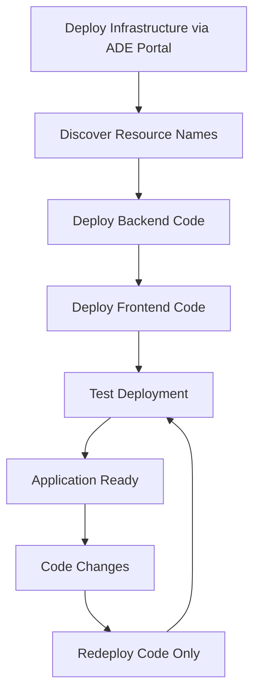

# Azure Deployment Environments (ADE) Guide

This guide provides comprehensive information about [Azure Deployment Environments](https://learn.microsoft.com/en-us/azure/deployment-environments/) implementation in the [Azure AI Foundry](https://learn.microsoft.com/en-us/azure/ai-foundry/) SPA project.

## 📋 Overview

Azure Deployment Environments (ADE) provides a self-service way for developers to create consistent, governed cloud environments. This project includes ADE catalog definitions for streamlined deployment.

## 🏗️ Architecture

```
┌─────────────────────────────────────────────────────────────────┐
│                    Azure Deployment Environment                 │
├─────────────────────────────────────────────────────────────────┤
│                                                                 │
│  ┌─────────────────────────────────────────────────────────────┐ │
│  │                  Environment Catalog                        │ │
│  │                                                             │ │
│  │  ┌─────────────────────────┐  ┌─────────────────────────────┐ │ │
│  │  │  Frontend Definition    │  │   Backend Definition        │ │ │
│  │  │  (environment.yaml)     │  │   (environment.yaml)        │ │ │
│  │  │                         │  │                             │ │ │
│  │  │  ┌─────────────────┐    │  │  ┌─────────────────────────┐ │ │ │
│  │  │  │ Bicep Template  │    │  │  │   Bicep Template        │ │ │ │
│  │  │  │ frontend.bicep  │    │  │  │   backend.bicep         │ │ │ │
│  │  │  └─────────────────┘    │  │  └─────────────────────────┘ │ │ │
│  │  └─────────────────────────┘  └─────────────────────────────┘ │ │
│  └─────────────────────────────────────────────────────────────┘ │
│                                                                 │
│  ┌─────────────────────────────────────────────────────────────┐ │
│  │                 Developer Portal                            │ │
│  │           (Self-Service Environment Creation)               │ │
│  └─────────────────────────────────────────────────────────────┘ │
└─────────────────────────────────────────────────────────────────┘
```

## 📁 Catalog Structure

```
infra/catalogs/
├── frontend/
│   ├── environment.yaml          # ADE manifest for frontend
│   ├── manifest.schema.json      # Local copy of ADE schema for validation
│   └── README.md                 # Frontend environment documentation
└── backend/                      # Future: Backend environment
    ├── environment.yaml          # ADE manifest for backend
    ├── manifest.schema.json      # Local copy of ADE schema for validation
    └── README.md                 # Backend environment documentation
```

## 📝 Environment Definition Schema

### Required Properties

According to the [official Azure Deployment Environment schema](https://learn.microsoft.com/en-us/azure/deployment-environments/concept-environment-yaml), only these properties are **required**:

- `name` - Display name of the catalog item
- `templatePath` - Relative path to the entry template file

### Supported Properties

The complete list of **officially supported** properties:

| Property | Type | Required | Description | Example |
|----------|------|----------|-------------|---------|
| `name` | string | ✅ Yes | Display name of the catalog item | `AI_Foundry_SPA_Frontend` |
| `version` | string | ❌ No | Version of the catalog item | `1.0.0` |
| `summary` | string | ❌ No | Short summary of the catalog item | `Frontend infrastructure for AI Foundry SPA` |
| `description` | string | ❌ No | Detailed description | Multi-line description with \| |
| `runner` | string | ❌ No | Container image for running actions | `ARM`, `Bicep`, `Terraform` |
| `templatePath` | string | ✅ Yes | Relative path to template file | `../../modules/frontend.bicep` |
| `parameters` | array | ❌ No | Input parameters for the environment | See parameter schema below |

### Parameter Schema

Each parameter in the `parameters` array supports:

| Property | Type | Required | Description | Example |
|----------|------|----------|-------------|---------|
| `id` | string | ✅ Yes | Unique parameter identifier | `applicationName` |
| `name` | string | ❌ No | Display name for the parameter | `Application Name` |
| `description` | string | ❌ No | Parameter description | `Name used for resource naming` |
| `type` | string | ❌ No | Data type (default: string) | `string`, `boolean`, `integer`, `number`, `object`, `array` |
| `required` | boolean | ❌ No | Whether parameter is required | `true`, `false` |
| `default` | various | ❌ No | Default value (only for non-required params) | `aibox` |
| `allowed` | array | ❌ No | Array of allowed values | `[dev, staging, prod]` |
| `readOnly` | boolean | ❌ No | Whether parameter is read-only | `true`, `false` |

#### ⚠️ **CRITICAL RULE**: Required Parameters and Defaults
- **❌ Parameters with `required: true` MUST NOT have `default` values**
- **✅ Parameters with `required: false` (or omitted) CAN have `default` values**
- **Reason**: Required parameters force users to make explicit choices in ADE portal

## ✅ Frontend Environment Definition

### File: `infra/catalogs/frontend/environment.yaml`

```yaml
# yaml-language-server: $schema=./manifest.schema.json
name: AI_Foundry_SPA_Frontend
version: 1.0.0
summary: Frontend infrastructure for AI Foundry SPA application
description: |
  Deploys the frontend infrastructure for the AI Foundry SPA application including:
  - Azure Static Web App for SPA hosting with built-in CDN and SSL
  - Application Insights for frontend monitoring and analytics
  - Integration with existing Log Analytics Workspace for consolidated logging

runner: Bicep
templatePath: ../../modules/frontend.bicep

parameters:
  - id: applicationName
    name: Application Name
    description: Name used for resource naming
    type: string
    required: true
    
  - id: environmentName
    name: Environment Name
    description: Environment identifier
    type: string
    required: true
    allowed:
      - dev
      - staging
      - prod
      
  - id: location
    name: Azure Region
    description: Azure region for resource deployment
    type: string
    required: true
    allowed:
      - centralus
      - eastus
      - eastus2
      - westus
      - westus2
      - westus
      - westus2
```

## 🔧 Best Practices

### Schema Compliance

1. **✅ Always include schema validation** (choose one option):
   ```yaml
   # Option 1: Local schema file (recommended for offline development)
   # yaml-language-server: $schema=./manifest.schema.json
   
   # Option 2: Remote schema (always up-to-date)
   # yaml-language-server: $schema=https://github.com/Azure/deployment-environments/releases/download/2022-11-11-preview/manifest.schema.json
   ```

2. **✅ Use unquoted strings** for simple values:
   ```yaml
   # ✅ Correct
   - id: applicationName
     type: string
     default: aibox
   
   # ❌ Incorrect (unnecessary quotes)
   - id: "applicationName"
     type: "string"
     default: "aibox"
   ```

3. **✅ Use relative paths** for templatePath:
   ```yaml
   # ✅ Correct - relative from catalog root
   templatePath: ../../modules/frontend.bicep
   
   # ❌ Incorrect - absolute paths not supported
   templatePath: /infra/modules/frontend.bicep
   ```

### Parameter Design

1. **✅ Provide sensible defaults** for non-required parameters only
2. **✅ Use `allowed` arrays** for restricted values
3. **✅ Mark parameters as `required: true`** when user input is mandatory
4. **✅ Include descriptive `description`** fields
5. **❌ NEVER use `default` with `required: true`** - this violates ADE schema rules

### YAML Structure

1. **❌ Do NOT include `outputs` section** - not supported by ADE schema
2. **❌ Do NOT include custom metadata** - only use officially supported properties
3. **✅ Validate YAML syntax** before deployment
4. **✅ Use proper indentation** (2 spaces)

## 🚫 Common Mistakes to Avoid

### 1. Including Unsupported Properties

```yaml
# ❌ WRONG - outputs not supported in ADE schema
outputs:
  - id: staticWebAppUrl
    name: Static Web App URL
    type: string

# ❌ WRONG - custom metadata not supported
metadata:
  category: Web Applications
  complexity: Simple
```

### 2. Incorrect Parameter Syntax

```yaml
# ❌ WRONG - unnecessary quotes everywhere
parameters:
  - id: "applicationName"
    name: "Application Name"
    type: "string"
    required: "true"
    default: "aibox"

# ✅ CORRECT - minimal quotes
parameters:
  - id: applicationName
    name: Application Name
    type: string
    required: true
    
  - id: optionalParam
    name: Optional Parameter
    type: string
    required: false
    default: someDefault
```

### 3. Required Parameters with Defaults (CRITICAL ERROR)

```yaml
# ❌ WRONG - required parameter with default value
parameters:
  - id: applicationName
    name: Application Name
    type: string
    required: true
    default: aibox      # ← This violates ADE schema!

# ✅ CORRECT - required parameter without default
parameters:
  - id: applicationName
    name: Application Name
    type: string
    required: true
    
  # OR: optional parameter with default
  - id: applicationName
    name: Application Name
    type: string
    required: false     # ← Only optional params can have defaults
    default: aibox
```

### 4. Absolute Paths

```yaml
# ❌ WRONG - absolute path
templatePath: /infra/modules/frontend.bicep

# ✅ CORRECT - relative path
templatePath: ../../modules/frontend.bicep
```

## 🔍 Validation

### Manual Validation

Check your environment.yaml file for:

1. **Schema compliance** - only use supported properties
2. **YAML syntax** - proper indentation and structure
3. **Parameter consistency** - ensure Bicep template has matching parameters
4. **Relative paths** - templatePath should be relative to catalog root

### Automated Validation

Use YAML schema validation in your editor by including the schema reference:

```yaml
# yaml-language-server: $schema=https://github.com/Azure/deployment-environments/releases/download/2022-11-11-preview/manifest.schema.json
```

## 🚀 Deployment

### Using Azure CLI

```bash
# Deploy the environment definition to your catalog
az deployment create \
  --template-file infra/catalogs/frontend/environment.yaml \
  --parameters @infra/dev-orchestrator.parameters.bicepparam
```

### Using ADE Portal

1. Navigate to Azure Deployment Environments in Azure Portal
2. Select your project and catalog
3. Choose the environment definition
4. Fill in required parameters
5. Deploy the environment

## 📦 Post-Deployment: Code Deployment Workflow

After deploying infrastructure through ADE, use the simplified deployment scripts to deploy application code.

### 🔍 Step 1: Discover Resource Names

ADE creates resources with specific naming patterns. You'll need to identify the exact names for deployment:

#### Method 1: ADE Portal
1. Go to your deployed ADE environment
2. Click on "Resources" tab
3. Note the Function App and Static Web App names
4. Note the resource group names

#### Method 2: Azure CLI Discovery
```powershell
# List all Function Apps in subscription (filter by naming pattern)
az functionapp list --query "[?contains(name, 'func-ai-foundry-spa-backend')].{name:name,resourceGroup:resourceGroup,state:state}" --output table

# List all Static Web Apps in subscription  
az staticwebapp list --query "[?contains(name, 'stapp-aibox-fd')].{name:name,resourceGroup:resourceGroup,defaultHostname:defaultHostname}" --output table

# If you know the resource group pattern
az functionapp list --resource-group "rg-ai-foundry-spa-backend-*" --query "[].{name:name,state:state}" --output table
az staticwebapp list --resource-group "rg-ai-foundry-spa-frontend-*" --query "[].{name:name,defaultHostname:defaultHostname}" --output table
```

### 🎯 Step 2: Deploy Backend Code

```powershell
# Deploy backend Function App code
./deploy-scripts/deploy-backend-func-code.ps1 `
    -FunctionAppName "func-ai-foundry-spa-backend-dev-eus2" `
    -ResourceGroupName "rg-ai-foundry-spa-backend-dev-eus2"
```

**Script automatically handles:**
- ✅ Azure CLI authentication validation
- ✅ Function App existence verification
- ✅ .NET Function App build and package creation
- ✅ Code deployment to Azure Function App
- ✅ Health endpoint testing
- ✅ Deployment summary with live URLs

### 🌐 Step 3: Deploy Frontend Code

```powershell
# Deploy frontend to Static Web App
./deploy-scripts/deploy-frontend-spa-code.ps1 `
    -StaticWebAppName "stapp-aibox-fd-dev-eus2" `
    -ResourceGroupName "rg-ai-foundry-spa-frontend-dev-eus2"

# Optional: Include backend URL for environment configuration
./deploy-scripts/deploy-frontend-spa-code.ps1 `
    -StaticWebAppName "stapp-aibox-fd-dev-eus2" `
    -ResourceGroupName "rg-ai-foundry-spa-frontend-dev-eus2" `
    -BackendUrl "https://func-ai-foundry-spa-backend-dev-eus2.azurewebsites.net/api"
```

**Script automatically handles:**
- ✅ Azure CLI authentication validation
- ✅ Static Web App existence verification
- ✅ DEV environment configuration with AI Foundry settings
- ✅ Frontend build (npm install + build)
- ✅ SWA CLI installation and deployment
- ✅ Deployment summary with live URLs

### 🔗 Step 4: Verification

```powershell
# Test the deployed Function App endpoints
./tests/core/Test-FunctionEndpoints.ps1 -BaseUrl "https://func-ai-foundry-spa-backend-dev-eus2.azurewebsites.net"

# Access the deployed frontend
# URL provided in deployment script output, typically:
# https://<static-web-app-name>.azurestaticapps.net
```

### 🔄 Typical ADE Workflow



## 🔄 CI/CD End-to-End Validation

The project includes **comprehensive CI/CD integration** with Azure Deployment Environments that provides true end-to-end validation of the complete deployment pipeline.

### Complete Validation Workflow

The CI/CD pipeline automatically performs full end-to-end validation on every push to main branch and pull requests:

#### 1. **ADE Environment Creation**
- Creates temporary ADE environments for both frontend and backend
- Uses unique naming with run attempt support for re-runs: `pr-fd-123-45-2` or `main-be-67-89-1`
- Automatically expires after 8 hours (no manual cleanup needed)

#### 2. **Infrastructure Deployment**
- Deploys Bicep templates through ADE catalog
- Validates DevCenter catalog compatibility
- Tests complete Azure resource provisioning

#### 3. **Application Code Deployment**
- **Frontend**: Deploys actual application code to ADE-created Static Web App
- **Backend**: Deploys actual Function App code to ADE-created Function App
- Uses the same deployment methods as production

#### 4. **Comprehensive Testing**
- **Health Endpoints**: Tests Function App health with retry logic
- **Functional Testing**: Validates AI integration and API responses
- **Application Testing**: Tests complete user workflow end-to-end
- **Integration Testing**: Validates frontend-backend communication

#### 5. **Automatic Cleanup**
- 8-hour automatic expiration eliminates manual cleanup
- Cost-effective temporary environment validation
- No resource accumulation or orphaned environments

### CI Workflow Integration

```yaml
# .github/workflows/ci.yml (simplified view)
jobs:
  # Build artifacts first
  frontend-build:
    # Creates frontend-dist artifact
  backend-build:
    # Creates backend-publish artifact

  # ADE End-to-End Validation
  deploy-ade-frontend-validation:
    needs: [bicep-validation, frontend-build]
    steps:
      - name: Create ADE Frontend Environment
        # Uses jq to inject dynamic environment name into parameters
        # Creates ADE environment with 8-hour expiration
      - name: Deploy Frontend Code to ADE Static Web App
        # Downloads frontend-dist artifact
        # Deploys to ADE-created Static Web App
      - name: Test Frontend Application
        # Tests application accessibility and functionality

  deploy-ade-backend-validation:
    needs: [bicep-validation, backend-build]
    steps:
      - name: Create ADE Backend Environment
        # Creates ADE environment with 8-hour expiration
      - name: Deploy Backend Code to ADE Function App
        # Downloads backend-publish artifact
        # Deploys ZIP to ADE-created Function App
      - name: Test Deployed Backend Application
        # Comprehensive endpoint testing with retry logic

  ade-validation-summary:
    needs: [deploy-ade-frontend-validation, deploy-ade-backend-validation]
    # Gates main branch deployment - only proceeds if ADE validation passes
```

### Key Benefits

#### For Development Teams
- **Early Problem Detection**: Catches deployment issues before production
- **Real Environment Testing**: Uses actual Azure resources, not mocks or stubs
- **Complete Pipeline Validation**: Tests the entire deployment workflow
- **Zero Maintenance**: Automatic cleanup eliminates resource management overhead

#### For Enterprise Organizations
- **DevCenter Validation**: Confirms ADE catalog compatibility in real environments
- **Governance Testing**: Validates policy compliance and resource naming
- **Cost Control**: Temporary environments with automatic expiration
- **Compliance**: Tests complete deployment pipeline in governed environments

#### For DevOps Teams
- **Pipeline Confidence**: Validates entire CI/CD pipeline before production deployment
- **Infrastructure Validation**: Tests Bicep templates in ADE context
- **Deployment Validation**: Tests actual application deployment procedures
- **Regression Prevention**: Catches breaking changes early in the development cycle

### Configuration Files

The ADE validation uses these configuration files:

```
infra/environments/
├── frontend/
│   └── ade.parameters.json    # Frontend ADE parameters with CI tags
└── backend/
    └── ade.parameters.json    # Backend ADE parameters with CI tags
```

**Resource Tagging for CI/CD:**
```json
{
  "resourceTags": {
    "value": {
      "Purpose": "CI/CD-ADE-Validation",
      "Component": "Frontend",
      "WorkflowRun": "Injected by CI",
      "Branch": "Injected by CI", 
      "DeleteAfter": "Injected by CI"
    }
  }
}
```

### Troubleshooting ADE Validation

#### Common Issues and Solutions

**Environment Creation Timeout:**
- ADE environments have 10-15 minute creation timeouts
- Check DevCenter catalog availability
- Verify ADE project permissions

**Application Deployment Failures:**
- Verify build artifacts are properly created
- Check Function App deployment package format
- Validate Static Web App token generation

**Test Failures:**
- Health endpoints may need warm-up time (60 seconds)
- Network propagation delays for Static Web Apps (30 seconds)
- AI Foundry connectivity requires proper RBAC assignments

#### Monitoring and Debugging

**GitHub Actions Logs:**
- Each step provides detailed deployment logs
- Failed deployments include resource error details
- Test results show specific endpoint failures

**Azure Portal:**
- Temporary resource groups: `ai-foundry-{environment-name}`
- Resource deployment status in ADE portal
- Application Insights for runtime errors

### Extending ADE Validation

To add additional validation steps:

1. **Modify CI Workflow**: Add new test steps to existing jobs
2. **Create New Test Scripts**: Add to `tests/core/` directory
3. **Update Artifacts**: Ensure required build outputs are available
4. **Configure Timeouts**: Account for additional deployment time

**Example: Adding Database Tests**
```yaml
- name: Test Database Connectivity
  run: |
    echo "🔍 Testing database connectivity..."
    # Your database test logic here
    pwsh -File tests/core/Test-DatabaseEndpoints.ps1 -ConnectionString "$DB_CONNECTION"
```

## 🔧 Parameter Extraction for CI/CD

This section describes the AI Foundry parameter extraction functionality for Azure Deployment Environments (ADE) in the CI/CD pipeline.

### Problem Statement

The CI pipeline needs to extract AI Foundry-specific settings from `ade.parameters.json` files because:

1. **No AI Foundry deployment to query**: The Foundry resource group was not deployed via ADE
2. **Configuration source**: All AI Foundry settings are stored in the backend ADE parameters file
3. **Cross-component usage**: Both frontend and backend deployments need access to the same AI Foundry configuration

### Reusable Helper Script

The solution provides a reusable helper script `tests/utilities/extract-ade-parameters.sh` that:

- Extracts AI Foundry parameters from ADE parameter files
- Validates required parameters are present
- Supports multiple output formats (env, json, export)
- Provides comprehensive error handling
- Can be used in CI workflows and for local testing

#### Usage Examples

**Validation Only:**
```bash
./tests/utilities/extract-ade-parameters.sh --validate-only
```

**Extract as Environment Variables:**
```bash
./tests/utilities/extract-ade-parameters.sh --output env
```

**Extract as JSON:**
```bash
./tests/utilities/extract-ade-parameters.sh --output json
```

**Source into Current Shell:**
```bash
source <(./tests/utilities/extract-ade-parameters.sh --output export --quiet)
echo $AI_FOUNDRY_ENDPOINT
```

**Custom Parameter File:**
```bash
./tests/utilities/extract-ade-parameters.sh --file custom-params.json --output json
```

### Parameters Extracted

The script extracts these AI Foundry parameters from the backend ADE configuration:

| Parameter | Environment Variable | Required | Description |
|-----------|---------------------|----------|-------------|
| `aiFoundryEndpoint` | `AI_FOUNDRY_ENDPOINT` | ✅ | AI Foundry API endpoint URL |
| `aiFoundryAgentId` | `AI_FOUNDRY_AGENT_ID` | ✅ | Specific agent identifier |
| `aiFoundryAgentName` | `AI_FOUNDRY_AGENT_NAME` | ⚠️ | Agent display name (defaults to "AI in A Box") |
| `aiFoundryInstanceName` | `AI_FOUNDRY_INSTANCE_NAME` | ❌ | AI Foundry instance/workspace name |
| `aiFoundryResourceGroupName` | `AI_FOUNDRY_RG_NAME` | ❌ | Resource group containing AI Foundry |

### CI Workflow Integration

The CI workflow (`ci.yml`) uses the helper script for parameter extraction:

#### Before (Inline Code)
```bash
# Read AI Foundry configuration from ade.parameters.json
AI_FOUNDRY_ENDPOINT=$(jq -r '.aiFoundryEndpoint' infra/environments/backend/ade.parameters.json)
AI_FOUNDRY_AGENT_ID=$(jq -r '.aiFoundryAgentId' infra/environments/backend/ade.parameters.json)
# ... more inline validation logic
```

#### After (Helper Script)
```bash
# Use the reusable helper script to extract AI Foundry parameters
if ! PARAMETER_OUTPUT=$(./tests/utilities/extract-ade-parameters.sh -o export -q); then
    echo "❌ Failed to extract AI Foundry parameters"
    exit 1
fi
eval "$PARAMETER_OUTPUT"
```

### Testing Parameter Extraction

#### Test Scripts
1. **Basic validation**: `tests/test-ade-parameter-extraction.sh` (original)
2. **Enhanced testing**: `tests/test-ade-parameter-extraction-enhanced.sh` (comprehensive)

#### Run Tests
```bash
# Run original test
./tests/test-ade-parameter-extraction.sh

# Run enhanced test suite
./tests/test-ade-parameter-extraction-enhanced.sh
```

#### Test Coverage
The enhanced test suite covers:
- ✅ Original extraction logic (backward compatibility)
- ✅ New helper script functionality
- ✅ Error handling (invalid JSON, missing parameters, non-existent files)
- ✅ Parameter sourcing capability
- ✅ CI workflow integration simulation
- ✅ Multiple output formats

### Error Handling

The helper script provides comprehensive error handling:

#### Invalid JSON Syntax
```bash
$ ./tests/utilities/extract-ade-parameters.sh -f invalid.json
❌ Invalid JSON syntax in parameters file: invalid.json
```

#### Missing Required Parameters
```bash
$ ./tests/utilities/extract-ade-parameters.sh -f missing-params.json
❌ Missing or invalid required parameter: aiFoundryEndpoint
❌ Parameter validation failed. Required AI Foundry parameters are missing.
```

#### Non-existent File
```bash
$ ./tests/utilities/extract-ade-parameters.sh -f nonexistent.json
❌ ADE parameters file not found: nonexistent.json
```

### Output Formats

#### Environment Variables (`env`)
```
AI_FOUNDRY_ENDPOINT=https://ai-foundry-dev-eus.services.ai.azure.com/api/projects/firstProject
AI_FOUNDRY_AGENT_ID=asst_dH7M0nbmdRblhSQO8nIGIYF4
AI_FOUNDRY_AGENT_NAME=AI in A Box
```

#### Export Format (`export`)
```bash
export AI_FOUNDRY_ENDPOINT="https://ai-foundry-dev-eus.services.ai.azure.com/api/projects/firstProject"
export AI_FOUNDRY_AGENT_ID="asst_dH7M0nbmdRblhSQO8nIGIYF4"
export AI_FOUNDRY_AGENT_NAME="AI in A Box"
```

#### JSON Format (`json`)
```json
{
  "aiFoundryEndpoint": "https://ai-foundry-dev-eus.services.ai.azure.com/api/projects/firstProject",
  "aiFoundryAgentId": "asst_dH7M0nbmdRblhSQO8nIGIYF4", 
  "aiFoundryAgentName": "AI in A Box"
}
```
