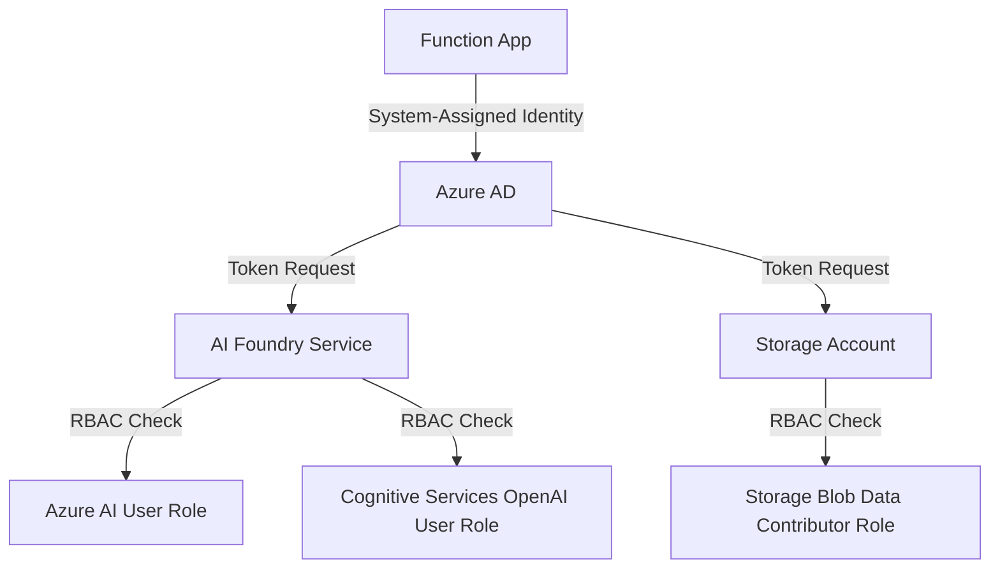

# RBAC Assignment Reference

This document provides comprehensive documentation of all Role-Based Access Control (RBAC) assignments in the AI in A Box infrastructure, including roles, scopes, purposes, and implementation details.

## 🎯 Overview

The AI in A Box infrastructure implements **least-privilege security** using Azure Managed Identity and RBAC assignments. The Function App uses a system-assigned managed identity to securely access Azure AI Foundry and storage resources without storing any credentials.

## 🔐 Security Architecture

### Managed Identity Flow



### Security Benefits

- ✅ **No Stored Credentials**: All authentication uses Azure-managed tokens
- ✅ **Automatic Token Rotation**: Azure handles token lifecycle management
- ✅ **Least Privilege**: Each role grants only necessary permissions
- ✅ **Audit Trail**: All access attempts are logged and trackable
- ✅ **Cross-Resource Group**: Secure access across resource boundaries

## 📋 Complete RBAC Assignments

### Backend Function App Identity

**Principal Type**: `ServicePrincipal` (System-Assigned Managed Identity)
**Principal ID**: Dynamically generated during Function App deployment

| Role | Scope | Resource Type | Assignment Location | Purpose |
|------|-------|---------------|-------------------|---------|
| **Storage Blob Data Contributor** | Resource Group | Storage Account | Backend RG | Function App storage access |
| **Azure AI User** | Cross-RG | Cognitive Services | AI Foundry RG | AI project access |
| **Cognitive Services OpenAI User** | Cross-RG | Cognitive Services | AI Foundry RG | OpenAI API access |

## 🔑 Role Definitions Reference

### Storage Blob Data Contributor

**Role Definition ID**: `ba92f5b4-2d11-453d-a403-e96b0029c9fe`

**Purpose**: Required for Function App Flex Consumption model to access storage account

**Permissions Granted**:
- Read, write, and delete blob storage data
- List storage containers and blobs
- Generate user delegation SAS tokens
- Access blob metadata and properties

**Scope**: Backend resource group containing the storage account

**Why Required**: Azure Functions Flex Consumption model requires blob storage access for:
- Function code deployment
- Runtime state management
- Temporary file storage
- Execution telemetry

**Implementation**:
```bicep
resource functionAppStorageBlobRoleAssignment 'Microsoft.Authorization/roleAssignments@2022-04-01' = {
  name: guid(resourceGroup().id, resourceNames.functionApp, 'storage-blob-contributor-v2')
  scope: resourceGroup()
  properties: {
    roleDefinitionId: subscriptionResourceId(
      'Microsoft.Authorization/roleDefinitions',
      'ba92f5b4-2d11-453d-a403-e96b0029c9fe'
    )
    principalId: functionApp.outputs.systemAssignedMIPrincipalId!
    principalType: 'ServicePrincipal'
    description: 'Grants Storage Blob Data Contributor access to Function App managed identity for Flex Consumption model'
  }
}
```

### Azure AI User

**Role Definition ID**: `53ca6127-db72-4b80-b1b0-d745d6d5456d`

**Purpose**: Required for reading and calling AI Foundry agents at the project level

**Permissions Granted**:
- Read AI projects and workspaces
- List AI models and deployments
- Access AI Foundry project endpoints
- View project configuration and metadata
- Execute AI agent operations

**Scope**: AI Foundry Cognitive Services account (cross-resource group)

**Why Required**: This role provides the minimum permissions needed to:
- Discover available AI agents
- Access AI project endpoints
- Execute AI agent conversations
- Read project metadata

**Implementation**:
```bicep
module aiFoundryUserRbac 'rbac.bicep' = {
  name: 'backend-aifoundry-user-rbac-${uniqueString(resourceGroup().id, resourceNames.functionApp)}'
  scope: resourceGroup(aiFoundryResourceGroupName)
  params: {
    principalId: functionApp.outputs.systemAssignedMIPrincipalId!
    roleDefinitionId: subscriptionResourceId('Microsoft.Authorization/roleDefinitions', '53ca6127-db72-4b80-b1b0-d745d6d5456d')
    targetResourceId: aiFoundryInstance.id
    principalType: 'ServicePrincipal'
  }
}
```

### Cognitive Services OpenAI User

**Role Definition ID**: `a97b65f3-24c7-4388-baec-2e87135dc908`

**Purpose**: Required for creating threads, sending messages, and reading responses from OpenAI services

**Permissions Granted**:
- Create and manage conversation threads
- Send messages to AI models
- Read AI model responses
- Access OpenAI API endpoints
- Execute chat completions
- Manage conversation state

**Scope**: AI Foundry Cognitive Services account (cross-resource group)

**Why Required**: This role provides the specific permissions needed to:
- Create new conversation threads with AI agents
- Send user messages to the AI model
- Retrieve AI responses and streaming data
- Manage conversation context and history

**Implementation**:
```bicep
module aiFoundryOpenAIRbac 'rbac.bicep' = {
  name: 'backend-aifoundry-openai-rbac-${uniqueString(resourceGroup().id)}'
  scope: resourceGroup(aiFoundryResourceGroupName)
  params: {
    principalId: functionApp.outputs.systemAssignedMIPrincipalId!
    roleDefinitionId: subscriptionResourceId('Microsoft.Authorization/roleDefinitions', 'a97b65f3-24c7-4388-baec-2e87135dc908')
    targetResourceId: aiFoundryInstance.id
    principalType: 'ServicePrincipal'
  }
}
```

## 🏗️ Assignment Implementation

### RBAC Module Structure

**Backend Environment RBAC** (`infra/environments/backend/rbac.bicep`):
```bicep
targetScope = 'resourceGroup'

@description('Principal ID of the managed identity')
param principalId string

@description('Role definition ID for the assignment')
param roleDefinitionId string

@description('Resource ID of the target resource')
param targetResourceId string

@description('Principal type (ServicePrincipal, User, Group)')
param principalType string = 'ServicePrincipal'

resource roleAssignment 'Microsoft.Authorization/roleAssignments@2022-04-01' = {
  name: guid(principalId, roleDefinitionId, targetResourceId)
  properties: {
    roleDefinitionId: roleDefinitionId
    principalId: principalId
    principalType: principalType
  }
}
```

**Generic RBAC Module** (`infra/modules/rbac-assignment.bicep`):
```bicep
@description('Unique suffix to append to GUID generation for role assignment naming')
param uniqueSuffix string = ''

@description('Description of the role assignment purpose')
param roleDescription string = ''

var roleAssignmentName = guid(targetResourceId, principalId, roleDefinitionId, uniqueSuffix)

resource roleAssignment 'Microsoft.Authorization/roleAssignments@2022-04-01' = {
  name: roleAssignmentName
  properties: {
    roleDefinitionId: subscriptionResourceId('Microsoft.Authorization/roleDefinitions', roleDefinitionId)
    principalId: principalId
    principalType: principalType
    description: roleDescription
  }
}
```

### Cross-Resource Group Assignment Pattern

The infrastructure handles cross-resource group RBAC assignments using the module scoping pattern:

```bicep
// Deploy RBAC in target resource group
module crossRgRbac 'rbac.bicep' = {
  name: 'cross-rg-rbac-assignment'
  scope: resourceGroup(targetResourceGroupName)  // Target resource group
  params: {
    principalId: sourceIdentity.principalId      // Source managed identity
    roleDefinitionId: roleId                     // Required role
    targetResourceId: targetResource.id          // Target resource
    principalType: 'ServicePrincipal'
  }
}
```

## 🔍 Assignment Validation

### Verification Commands

**Check Role Assignments for Function App**:
```bash
# Get Function App principal ID
PRINCIPAL_ID=$(az functionapp identity show \
  --name "func-myapp-backend-dev-eus2" \
  --resource-group "rg-myapp-backend-dev-eus2" \
  --query principalId -o tsv)

# List all role assignments for the principal
az role assignment list \
  --assignee $PRINCIPAL_ID \
  --output table
```

**Verify Specific Role Assignment**:
```bash
# Check Azure AI User role
az role assignment list \
  --assignee $PRINCIPAL_ID \
  --role "Azure AI User" \
  --scope "/subscriptions/{subscription-id}/resourceGroups/{ai-foundry-rg}/providers/Microsoft.CognitiveServices/accounts/{cs-name}"
```

**Test AI Foundry Access**:
```bash
# Using Azure CLI with managed identity (from Function App environment)
az rest \
  --method GET \
  --url "https://{ai-foundry-endpoint}/api/projects/{project-name}" \
  --resource "https://cognitiveservices.azure.com/"
```

### PowerShell Validation Script

```powershell
# Test RBAC assignments for Function App
param(
    [Parameter(Mandatory=$true)]
    [string]$FunctionAppName,
    
    [Parameter(Mandatory=$true)]
    [string]$ResourceGroupName,
    
    [Parameter(Mandatory=$true)]
    [string]$AiFoundryResourceGroup
)

# Get Function App managed identity
$identity = az functionapp identity show --name $FunctionAppName --resource-group $ResourceGroupName | ConvertFrom-Json

if (-not $identity.principalId) {
    Write-Error "Function App managed identity not found"
    exit 1
}

Write-Host "✅ Function App managed identity: $($identity.principalId)"

# Check required role assignments
$requiredRoles = @(
    @{ Role = "Storage Blob Data Contributor"; Scope = $ResourceGroupName }
    @{ Role = "Azure AI User"; Scope = $AiFoundryResourceGroup }
    @{ Role = "Cognitive Services OpenAI User"; Scope = $AiFoundryResourceGroup }
)

foreach ($roleCheck in $requiredRoles) {
    $assignments = az role assignment list --assignee $identity.principalId --role $roleCheck.Role --resource-group $roleCheck.Scope | ConvertFrom-Json
    
    if ($assignments.Count -gt 0) {
        Write-Host "✅ Role '$($roleCheck.Role)' assigned to '$($roleCheck.Scope)'"
    } else {
        Write-Warning "❌ Role '$($roleCheck.Role)' NOT assigned to '$($roleCheck.Scope)'"
    }
}
```

## ⚠️ Security Considerations

### Least Privilege Principles

**What We Use**:
- ✅ **Azure AI User**: Project-level access (not Contributor/Owner)
- ✅ **Cognitive Services OpenAI User**: API access only (not admin)
- ✅ **Storage Blob Data Contributor**: Data access only (not account management)

**What We Avoid**:
- ❌ **Contributor/Owner roles**: Too broad permissions
- ❌ **Subscription-level assignments**: Excessive scope
- ❌ **Key-based authentication**: Security vulnerabilities
- ❌ **Hardcoded credentials**: Rotation and audit issues

### Assignment Scope Best Practices

| Resource Type | Recommended Scope | Reason |
|---------------|-------------------|--------|
| Storage Account | Resource Group | Function App needs access to its storage only |
| AI Foundry | Specific Resource | Limit access to designated AI services only |
| Log Analytics | Resource | Specific workspace access for telemetry |

### Common Security Anti-Patterns

**❌ Avoid These Patterns**:
```bicep
// DON'T: Too broad scope
scope: subscription()

// DON'T: Too many permissions  
roleDefinitionId: 'Contributor'

// DON'T: Manual GUID generation
name: '12345678-1234-1234-1234-123456789012'

// DON'T: Hardcoded principal IDs
principalId: 'fixed-guid-value'
```

**✅ Use These Patterns**:
```bicep
// DO: Specific resource scope
scope: resourceGroup(targetResourceGroupName)

// DO: Least privilege roles
roleDefinitionId: 'Azure AI User'

// DO: Deterministic GUID generation
name: guid(principalId, roleDefinitionId, targetResourceId)

// DO: Dynamic principal ID from deployment
principalId: functionApp.outputs.systemAssignedMIPrincipalId!
```

## 🛠️ Troubleshooting RBAC Issues

### Common Problems and Solutions

**Problem**: "Insufficient privileges to complete the operation"
**Cause**: RBAC assignment creation requires User Access Administrator role
**Solution**: Ensure deployment principal has User Access Administrator role on target scope

**Problem**: "Principal does not exist"
**Cause**: Trying to assign roles before managed identity is fully created
**Solution**: Add explicit `dependsOn` declarations for identity creation

**Problem**: "Role assignment already exists"
**Cause**: GUID collision in role assignment naming
**Solution**: Use unique suffix in `guid()` function or add timestamp

**Problem**: Function App cannot access AI Foundry after deployment
**Cause**: RBAC assignment not propagated or incorrect scope
**Solution**: 
1. Wait 5-10 minutes for propagation
2. Verify assignment scope matches resource location
3. Check principal ID matches deployed identity

### Diagnostic Commands

**Verify Managed Identity Propagation**:
```bash
# Check if identity is visible in Azure AD
az ad sp show --id $PRINCIPAL_ID
```

**Test Token Acquisition**:
```bash
# From Function App environment, test token request
curl -H "Metadata: true" \
  "http://169.254.169.254/metadata/identity/oauth2/token?api-version=2018-02-01&resource=https://cognitiveservices.azure.com/"
```

**Check Role Assignment Propagation**:
```bash
# Check assignment exists and is active
az role assignment list \
  --assignee $PRINCIPAL_ID \
  --include-inherited \
  --include-groups
```

## 📚 Related Documentation

- **[Resource Deployment Reference](resource-deployment-reference.md)** - Complete resource inventory and deployment scenarios
- **[Infrastructure Overview](infrastructure.md)** - Detailed architecture and security design
- **[Security Best Practices](../advanced/security.md)** - Advanced security considerations
- **[Troubleshooting Guide](../operations/troubleshooting.md)** - Common issues and solutions

---

**Need to validate your RBAC assignments?** → Use the [RBAC Validation Script](../../scripts/Test-RbacAssignments.ps1) to automatically verify all role assignments are correct.