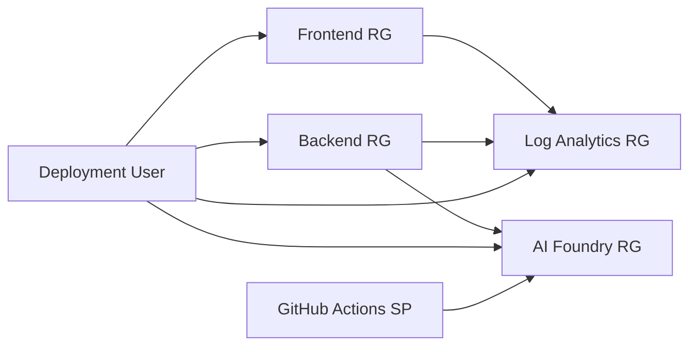

# Access Requirements for AI Foundry SPA Deployment

This document provides comprehensive guidance on the RBAC (Role-Based Access Control) roles and permissions required to successfully deploy and operate the AI Foundry SPA infrastructure using the main orchestrator Bicep template (`infra/main-orchestrator.bicep`).

## 📋 Quick Reference - Required Roles

### Deployment User/Service Principal
- **Subscription Level**: `Contributor` + `User Access Administrator`
- **AI Foundry Subscription**: `Reader` + `Azure AI Developer` (if cross-subscription)
- **Purpose**: Deploy infrastructure and assign cross-resource group RBAC

### Runtime Identities
- **Function App → AI Foundry**: `Azure AI Developer` (64702f94-c441-49e6-a78b-ef80e0188fee)
- **Function App → Storage**: `Storage Blob Data Contributor` (ba92f5b4-2d11-453d-a403-e96b0029c9fe)
- **GitHub Actions Service Principal → AI Foundry**: `Azure AI Developer` (64702f94-c441-49e6-a78b-ef80e0188fee)

## 🎯 Deployment User/Service Principal Requirements

### Subscription-Level Permissions

The deployment user (human user or service principal running the deployment) requires elevated permissions at the subscription level to:

- Create multiple resource groups across different components
- Deploy Azure Verified Modules (AVM) from the public registry
- Assign RBAC roles across resource groups
- Create managed identities and assign them appropriate permissions

#### Required Roles

| Role | Role ID | Scope | Justification |
|------|---------|-------|---------------|
| **Contributor** | `b24988ac-6180-42a0-ab88-20f7382dd24c` | Target Subscription | Create and manage all Azure resources |
| **User Access Administrator** | `18d7d88d-d35e-4fb5-a5c3-7773c20a72d9` | Target Subscription | Assign RBAC roles across resource groups |

#### Alternative: Custom Role with Minimal Permissions

For enterprise environments requiring least privilege, create a custom role with these specific permissions:

```json
{
  "roleName": "AI Foundry SPA Deployer",
  "description": "Custom role for AI Foundry SPA infrastructure deployment",
  "assignableScopes": ["/subscriptions/{subscription-id}"],
  "permissions": [
    {
      "actions": [
        "Microsoft.Resources/subscriptions/resourceGroups/*",
        "Microsoft.Web/sites/*",
        "Microsoft.Web/serverfarms/*",
        "Microsoft.Storage/storageAccounts/*",
        "Microsoft.Insights/components/*",
        "Microsoft.OperationalInsights/workspaces/read",
        "Microsoft.CognitiveServices/accounts/*",
        "Microsoft.MachineLearningServices/workspaces/*",
        "Microsoft.Authorization/roleAssignments/*",
        "Microsoft.Resources/deployments/*",
        "Microsoft.Resources/deploymentScripts/*"
      ],
      "notActions": [],
      "dataActions": [],
      "notDataActions": []
    }
  ]
}
```

### Cross-Subscription Access (AI Foundry in Different Subscription)

When the AI Foundry resources exist in a different subscription from the deployment target:

| Role | Scope | Purpose |
|------|-------|---------|
| **Reader** | AI Foundry Subscription | Access existing AI Foundry resource metadata |
| **Azure AI Developer** | AI Foundry Resource Group | Enable deployment script to create agents |

### GitHub Actions Service Principal Requirements

For CI/CD pipelines using GitHub Actions, the service principal stored in `AZURE_CREDENTIALS` secret requires:

| Role | Scope | Purpose |
|------|-------|---------|
| **Contributor** | Target Subscription | Deploy infrastructure resources |
| **User Access Administrator** | Target Subscription | Assign RBAC roles during deployment |
| **Azure AI Developer** | AI Foundry Resource | Deploy and manage AI Foundry agents |

**Note**: The same service principal handles both infrastructure deployment and agent management in GitHub Actions workflows.

## 🔧 Runtime Identity Requirements

### Function App Managed Identity Permissions

The Function App uses a **system-assigned managed identity** to access Azure services. The following roles are automatically assigned during deployment:

#### AI Foundry Access
- **Role**: `Azure AI Developer`
- **Role ID**: `64702f94-c441-49e6-a78b-ef80e0188fee`
- **Scope**: Specific AI Foundry Cognitive Services account
- **Assigned By**: `environments/backend/rbac.bicep` (cross-resource group module)
- **Purpose**: Make API calls to AI Foundry for chat completions
- **Permission Details**:
  - `Microsoft.CognitiveServices/accounts/read`
  - `Microsoft.MachineLearningServices/workspaces/datastores/*`
  - `Microsoft.MachineLearningServices/workspaces/experiments/*`
  - AI Foundry API access permissions

#### Storage Account Access
- **Role**: `Storage Blob Data Contributor`
- **Role ID**: `ba92f5b4-2d11-453d-a403-e96b0029c9fe`
- **Scope**: Function App storage account (same resource group)
- **Assigned By**: `environments/backend/main.bicep` (local assignment)
- **Purpose**: Function App runtime storage for Flex Consumption model
- **Permission Details**:
  - `Microsoft.Storage/storageAccounts/blobServices/containers/read`
  - `Microsoft.Storage/storageAccounts/blobServices/containers/write`
  - `Microsoft.Storage/storageAccounts/blobServices/generateUserDelegationKey/action`

### GitHub Actions Service Principal Permissions

AI Foundry agent deployment is handled by GitHub Actions workflow using the `infra/agent_deploy.ps1` PowerShell script:

#### AI Foundry Agent Management
- **Role**: `Azure AI Developer`
- **Role ID**: `64702f94-c441-49e6-a78b-ef80e0188fee`
- **Scope**: Specific AI Foundry Cognitive Services account
- **Assigned By**: Manual assignment or infrastructure deployment
- **Purpose**: Create and update AI Foundry agents via REST API in GitHub Actions
- **Authentication**: Uses service principal credentials from `AZURE_CREDENTIALS` secret

## 📊 Component Access Matrix

### Frontend Component (`environments/frontend/main.bicep`)

| Azure Resource | Target Resource | Required Role | Scope | Assigned To |
|----------------|-----------------|---------------|-------|-------------|
| Static Web App | Frontend RG | Contributor* | Resource Group | Deployment User |
| Application Insights | Frontend RG | Contributor* | Resource Group | Deployment User |
| Log Analytics Reference | Log Analytics RG | Reader* | Resource Group | Deployment User |

*Included in Contributor role for deployment user

### Backend Component (`environments/backend/main.bicep`)

| Azure Resource | Target Resource | Required Role | Scope | Assigned To |
|----------------|-----------------|---------------|-------|-------------|
| Function App | Backend RG | Contributor* | Resource Group | Deployment User |
| Storage Account | Backend RG | Contributor* | Resource Group | Deployment User |
| Application Insights | Backend RG | Contributor* | Resource Group | Deployment User |
| **Function App MI** | **AI Foundry Resource** | **Azure AI Developer** | **Cognitive Services Account** | **Function App Identity** |
| **Function App MI** | **Storage Account** | **Storage Blob Data Contributor** | **Storage Account** | **Function App Identity** |

### AI Foundry Component (`modules/ai-foundry.bicep`)

| Azure Resource | Target Resource | Required Role | Scope | Assigned To |
|----------------|-----------------|---------------|-------|-------------|
| Cognitive Services | AI Foundry RG | Contributor* | Resource Group | Deployment User |
| AI Project | AI Foundry RG | Contributor* | Resource Group | Deployment User |
| Model Deployment | AI Foundry RG | Contributor* | Resource Group | Deployment User |

### GitHub Actions Agent Deployment

| Azure Resource | Target Resource | Required Role | Scope | Assigned To |
|----------------|-----------------|---------------|-------|-------------|
| **GitHub Actions** | **AI Foundry Resource** | **Azure AI Developer** | **Cognitive Services Account** | **Service Principal (AZURE_CREDENTIALS)** |

*Note: Agent deployment is now handled by GitHub Actions workflow using `infra/agent_deploy.ps1` PowerShell script*

## 🔒 Security Best Practices

### Least Privilege Principle

✅ **DO**:
- Scope role assignments to specific resources when possible
- Use service-specific roles (e.g., `Azure AI Developer` instead of `Contributor`)
- Apply roles at resource level rather than resource group level when feasible
- Use system-assigned managed identities for Azure services

❌ **DON'T**:
- Assign `Owner` role unless absolutely necessary
- Use `User Access Administrator` broader than required
- Grant subscription-level permissions when resource-level suffices
- Use shared service principals across environments

### Cross-Resource Group Security

The architecture requires careful handling of cross-resource group permissions:



**Security Considerations**:
- Function App in Backend RG needs access to AI Foundry in separate RG
- Cross-RG RBAC assignments require `User Access Administrator` role
- GitHub Actions service principal needs `Azure AI Developer` access to AI Foundry for agent deployment
- Each component maintains isolation while enabling necessary integration

### Role Assignment Naming

All role assignments use **deterministic GUID generation** to prevent conflicts:

```bicep
// ✅ CORRECT - Deterministic naming
name: guid(resourceGroup().id, functionAppName, storageAccountName, roleDefinitionId)

// ❌ INCORRECT - Literal strings can cause conflicts
name: 'function-app-storage-role'
```

## 🛠️ Azure Verified Module (AVM) Requirements

### Registry Access

The deployment uses multiple AVM modules from the public registry:

| Module | Version | Purpose |
|--------|---------|---------|
| `avm/res/resources/resource-group` | 0.4.0 | Resource group creation |
| `avm/res/resources/deployment-script` | 0.4.0 | Agent deployment automation |
| `avm/res/web/static-site` | 0.4.0 | Static Web App hosting |
| `avm/res/web/site` | 0.16.0 | Function App deployment |
| `avm/res/storage/storage-account` | 0.20.0 | Function App storage |
| `avm/res/insights/component` | 0.6.0 | Application Insights |

### Authentication Requirements

- **Azure CLI**: Must be authenticated with `az login`
- **Service Principal**: Requires `acrpull` permission on `br/public` registry
- **Registry Access**: Public AVM modules don't require additional permissions

## ✅ Pre-Deployment Checklist

### For Development Environments

- [ ] **Azure CLI authenticated**: `az login` completed successfully
- [ ] **Subscription context**: `az account set --subscription <subscription-id>`
- [ ] **User permissions**: Current user has `Contributor` + `User Access Administrator` on target subscription
- [ ] **AI Foundry access**: Can access existing AI Foundry resources (if using existing)
- [ ] **Resource limits**: Subscription has sufficient quota for Function Apps, Storage, etc.
- [ ] **Naming validation**: Resource names follow organizational standards

### For Production/Enterprise Environments

- [ ] **Service Principal configured**: Deployment service principal has required roles
- [ ] **Custom roles defined**: Enterprise-specific minimal permission roles created
- [ ] **Cross-subscription access**: AI Foundry subscription permissions configured
- [ ] **Network policies**: NSG and firewall rules accommodate Azure service communication
- [ ] **Compliance approval**: Security team approved cross-resource group RBAC assignments
- [ ] **Monitoring setup**: Log Analytics workspace exists or will be created
- [ ] **Backup strategy**: Backup policies for critical resources defined

### For CI/CD Pipelines (GitHub Actions)

- [ ] **Service Principal authentication**: GitHub Actions service principal properly configured
- [ ] **AZURE_CREDENTIALS secret**: GitHub secret contains valid service principal credentials
- [ ] **AI Foundry permissions**: Service principal has `Azure AI Developer` role on AI Foundry resource
- [ ] **Secret management**: Sensitive parameters stored in GitHub secrets or Azure Key Vault
- [ ] **Environment isolation**: Separate service principals for dev/staging/prod
- [ ] **Agent deployment permissions**: Service principal can create/update AI Foundry agents
- [ ] **Workflow validation**: Test GitHub Actions workflow with agent deployment

## 🔍 Troubleshooting Common Permission Issues

### Issue: "Insufficient privileges to complete the operation"

**Symptoms**:
```
Error: The client '<user/service-principal>' with object id '<guid>' does not have authorization to perform action 'Microsoft.Authorization/roleAssignments/write'
```

**Cause**: Missing `User Access Administrator` role for cross-resource group RBAC assignments

**Solution**:
1. Verify current permissions: `az role assignment list --assignee <user-id> --scope /subscriptions/<subscription-id>`
2. Assign required role: `az role assignment create --role "User Access Administrator" --assignee <user-id> --scope /subscriptions/<subscription-id>`
3. Wait 5-10 minutes for permission propagation

### Issue: "Cannot assign roles to managed identity"

**Symptoms**:
```
Error: Principal '<principal-id>' does not exist in the directory '<tenant-id>'
```

**Cause**: Attempting to assign role before managed identity is fully created

**Solution**:
- Ensure proper dependency ordering in Bicep templates
- Managed identity creation must complete before role assignment
- Use resource references, not string interpolation for principal IDs

### Issue: "Access denied to AI Foundry resources"

**Symptoms**:
```
Error: (Forbidden) The caller does not have permission to perform action 'Microsoft.CognitiveServices/accounts/listKeys' on resource '<ai-foundry-resource>'
```

**Cause**: 
- AI Foundry resource in different subscription
- Missing `Azure AI Developer` role
- Incorrect resource scoping

**Solution**:
1. Verify AI Foundry resource location: `az cognitiveservices account show --name <resource-name> --resource-group <rg-name>`
2. Check role assignments: `az role assignment list --scope <ai-foundry-resource-id>`
3. Assign correct role: Use `Azure AI Developer` (64702f94-c441-49e6-a78b-ef80e0188fee) not `Contributor`

### Issue: "AVM module not found or access denied"

**Symptoms**:
```
Error: The template reference 'br/public:avm/res/web/site:0.16.0' is not valid
```

**Cause**: 
- Azure CLI not authenticated
- Network restrictions blocking registry access
- Module version doesn't exist

**Solution**:
1. Re-authenticate: `az login --tenant <tenant-id>`
2. Test registry access: `az acr repository list --name mcr.microsoft.com`
3. Verify module version: Check [AVM documentation](https://azure.github.io/Azure-Verified-Modules/)

### Issue: "GitHub Actions agent deployment failed"

**Symptoms**:
```
Error: Agent deployment script failed in GitHub Actions workflow
```

**Cause**: 
- GitHub Actions service principal lacks AI Foundry permissions
- AI Foundry endpoint URL incorrect in workflow
- AZURE_CREDENTIALS secret invalid or expired
- Agent configuration YAML invalid

**Solution**:
1. Check GitHub Actions logs for detailed error messages
2. Verify AZURE_CREDENTIALS secret is valid: Test with `az login --service-principal`
3. Confirm service principal has `Azure AI Developer` role on AI Foundry resource
4. Validate AI Foundry endpoint URL format in workflow outputs
5. Test agent configuration YAML syntax and content

## 📚 Microsoft Documentation References

- [Azure RBAC built-in roles](https://learn.microsoft.com/en-us/azure/role-based-access-control/built-in-roles)
- [Azure AI services authentication and authorization](https://learn.microsoft.com/en-us/azure/ai-services/authentication)
- [Managed identities for Azure resources](https://learn.microsoft.com/en-us/entra/identity/managed-identities-azure-resources/)
- [Azure Resource Manager deployment scripts](https://learn.microsoft.com/en-us/azure/azure-resource-manager/bicep/deployment-script-bicep)
- [Azure Verified Modules (AVM)](https://learn.microsoft.com/en-us/azure/azure-resource-manager/bicep/avm/)
- [Azure Function App managed identity](https://learn.microsoft.com/en-us/azure/app-service/overview-managed-identity)
- [Cross-subscription RBAC assignments](https://learn.microsoft.com/en-us/azure/role-based-access-control/role-assignments-cross-subscription)

## 🎯 Summary

This documentation provides the complete RBAC roadmap for deploying the AI Foundry SPA infrastructure. The key takeaways:

1. **Deployment requires elevated permissions** - `Contributor` + `User Access Administrator` at subscription level
2. **Runtime uses least privilege** - Service-specific roles scoped to individual resources
3. **Cross-resource group access is managed** - Automated RBAC assignments handle integration
4. **Security is built-in** - Deterministic naming, managed identities, and proper scoping

Following these guidelines ensures successful deployment while maintaining security best practices and enterprise compliance requirements.