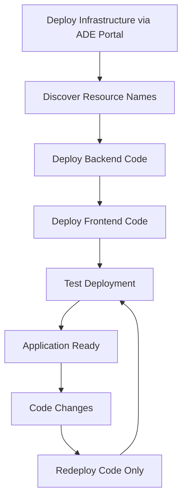

# Azure Deployment Environments (ADE) Guide

This guide provides comprehensive information about Azure Deployment Environments implementation in the AI Foundry SPA project.

## 📋 Overview

Azure Deployment Environments (ADE) provides a self-service way for developers to create consistent, governed cloud environments. This project includes ADE catalog definitions for streamlined deployment.

## 🏗️ Architecture

```
┌─────────────────────────────────────────────────────────────────┐
│                    Azure Deployment Environment                 │
├─────────────────────────────────────────────────────────────────┤
│                                                                 │
│  ┌─────────────────────────────────────────────────────────────┐ │
│  │                  Environment Catalog                        │ │
│  │                                                             │ │
│  │  ┌─────────────────────────┐  ┌─────────────────────────────┐ │ │
│  │  │  Frontend Definition    │  │   Backend Definition        │ │ │
│  │  │  (environment.yaml)     │  │   (environment.yaml)        │ │ │
│  │  │                         │  │                             │ │ │
│  │  │  ┌─────────────────┐    │  │  ┌─────────────────────────┐ │ │ │
│  │  │  │ Bicep Template  │    │  │  │   Bicep Template        │ │ │ │
│  │  │  │ frontend.bicep  │    │  │  │   backend.bicep         │ │ │ │
│  │  │  └─────────────────┘    │  │  └─────────────────────────┘ │ │ │
│  │  └─────────────────────────┘  └─────────────────────────────┘ │ │
│  └─────────────────────────────────────────────────────────────┘ │
│                                                                 │
│  ┌─────────────────────────────────────────────────────────────┐ │
│  │                 Developer Portal                            │ │
│  │           (Self-Service Environment Creation)               │ │
│  └─────────────────────────────────────────────────────────────┘ │
└─────────────────────────────────────────────────────────────────┘
```

## 📁 Catalog Structure

```
infra/catalogs/
├── frontend/
│   ├── environment.yaml          # ADE manifest for frontend
│   ├── manifest.schema.json      # Local copy of ADE schema for validation
│   └── README.md                 # Frontend environment documentation
└── backend/                      # Future: Backend environment
    ├── environment.yaml          # ADE manifest for backend
    ├── manifest.schema.json      # Local copy of ADE schema for validation
    └── README.md                 # Backend environment documentation
```

## 📝 Environment Definition Schema

### Required Properties

According to the [official Azure Deployment Environment schema](https://learn.microsoft.com/en-us/azure/deployment-environments/concept-environment-yaml), only these properties are **required**:

- `name` - Display name of the catalog item
- `templatePath` - Relative path to the entry template file

### Supported Properties

The complete list of **officially supported** properties:

| Property | Type | Required | Description | Example |
|----------|------|----------|-------------|---------|
| `name` | string | ✅ Yes | Display name of the catalog item | `AI_Foundry_SPA_Frontend` |
| `version` | string | ❌ No | Version of the catalog item | `1.0.0` |
| `summary` | string | ❌ No | Short summary of the catalog item | `Frontend infrastructure for AI Foundry SPA` |
| `description` | string | ❌ No | Detailed description | Multi-line description with \| |
| `runner` | string | ❌ No | Container image for running actions | `ARM`, `Bicep`, `Terraform` |
| `templatePath` | string | ✅ Yes | Relative path to template file | `../../modules/frontend.bicep` |
| `parameters` | array | ❌ No | Input parameters for the environment | See parameter schema below |

### Parameter Schema

Each parameter in the `parameters` array supports:

| Property | Type | Required | Description | Example |
|----------|------|----------|-------------|---------|
| `id` | string | ✅ Yes | Unique parameter identifier | `applicationName` |
| `name` | string | ❌ No | Display name for the parameter | `Application Name` |
| `description` | string | ❌ No | Parameter description | `Name used for resource naming` |
| `type` | string | ❌ No | Data type (default: string) | `string`, `boolean`, `integer`, `number`, `object`, `array` |
| `required` | boolean | ❌ No | Whether parameter is required | `true`, `false` |
| `default` | various | ❌ No | Default value (only for non-required params) | `aibox` |
| `allowed` | array | ❌ No | Array of allowed values | `[dev, staging, prod]` |
| `readOnly` | boolean | ❌ No | Whether parameter is read-only | `true`, `false` |

#### ⚠️ **CRITICAL RULE**: Required Parameters and Defaults
- **❌ Parameters with `required: true` MUST NOT have `default` values**
- **✅ Parameters with `required: false` (or omitted) CAN have `default` values**
- **Reason**: Required parameters force users to make explicit choices in ADE portal

## ✅ Frontend Environment Definition

### File: `infra/catalogs/frontend/environment.yaml`

```yaml
# yaml-language-server: $schema=./manifest.schema.json
name: AI_Foundry_SPA_Frontend
version: 1.0.0
summary: Frontend infrastructure for AI Foundry SPA application
description: |
  Deploys the frontend infrastructure for the AI Foundry SPA application including:
  - Azure Static Web App for SPA hosting with built-in CDN and SSL
  - Application Insights for frontend monitoring and analytics
  - Integration with existing Log Analytics Workspace for consolidated logging

runner: Bicep
templatePath: ../../modules/frontend.bicep

parameters:
  - id: applicationName
    name: Application Name
    description: Name used for resource naming
    type: string
    required: true
    
  - id: environmentName
    name: Environment Name
    description: Environment identifier
    type: string
    required: true
    allowed:
      - dev
      - staging
      - prod
      
  - id: location
    name: Azure Region
    description: Azure region for resource deployment
    type: string
    required: true
    allowed:
      - centralus
      - eastus
      - eastus2
      - westus
      - westus2
      - westus
      - westus2
```

## 🔧 Best Practices

### Schema Compliance

1. **✅ Always include schema validation** (choose one option):
   ```yaml
   # Option 1: Local schema file (recommended for offline development)
   # yaml-language-server: $schema=./manifest.schema.json
   
   # Option 2: Remote schema (always up-to-date)
   # yaml-language-server: $schema=https://github.com/Azure/deployment-environments/releases/download/2022-11-11-preview/manifest.schema.json
   ```

2. **✅ Use unquoted strings** for simple values:
   ```yaml
   # ✅ Correct
   - id: applicationName
     type: string
     default: aibox
   
   # ❌ Incorrect (unnecessary quotes)
   - id: "applicationName"
     type: "string"
     default: "aibox"
   ```

3. **✅ Use relative paths** for templatePath:
   ```yaml
   # ✅ Correct - relative from catalog root
   templatePath: ../../modules/frontend.bicep
   
   # ❌ Incorrect - absolute paths not supported
   templatePath: /infra/modules/frontend.bicep
   ```

### Parameter Design

1. **✅ Provide sensible defaults** for non-required parameters only
2. **✅ Use `allowed` arrays** for restricted values
3. **✅ Mark parameters as `required: true`** when user input is mandatory
4. **✅ Include descriptive `description`** fields
5. **❌ NEVER use `default` with `required: true`** - this violates ADE schema rules

### YAML Structure

1. **❌ Do NOT include `outputs` section** - not supported by ADE schema
2. **❌ Do NOT include custom metadata** - only use officially supported properties
3. **✅ Validate YAML syntax** before deployment
4. **✅ Use proper indentation** (2 spaces)

## 🚫 Common Mistakes to Avoid

### 1. Including Unsupported Properties

```yaml
# ❌ WRONG - outputs not supported in ADE schema
outputs:
  - id: staticWebAppUrl
    name: Static Web App URL
    type: string

# ❌ WRONG - custom metadata not supported
metadata:
  category: Web Applications
  complexity: Simple
```

### 2. Incorrect Parameter Syntax

```yaml
# ❌ WRONG - unnecessary quotes everywhere
parameters:
  - id: "applicationName"
    name: "Application Name"
    type: "string"
    required: "true"
    default: "aibox"

# ✅ CORRECT - minimal quotes
parameters:
  - id: applicationName
    name: Application Name
    type: string
    required: true
    
  - id: optionalParam
    name: Optional Parameter
    type: string
    required: false
    default: someDefault
```

### 3. Required Parameters with Defaults (CRITICAL ERROR)

```yaml
# ❌ WRONG - required parameter with default value
parameters:
  - id: applicationName
    name: Application Name
    type: string
    required: true
    default: aibox      # ← This violates ADE schema!

# ✅ CORRECT - required parameter without default
parameters:
  - id: applicationName
    name: Application Name
    type: string
    required: true
    
  # OR: optional parameter with default
  - id: applicationName
    name: Application Name
    type: string
    required: false     # ← Only optional params can have defaults
    default: aibox
```

### 4. Absolute Paths

```yaml
# ❌ WRONG - absolute path
templatePath: /infra/modules/frontend.bicep

# ✅ CORRECT - relative path
templatePath: ../../modules/frontend.bicep
```

## 🔍 Validation

### Manual Validation

Check your environment.yaml file for:

1. **Schema compliance** - only use supported properties
2. **YAML syntax** - proper indentation and structure
3. **Parameter consistency** - ensure Bicep template has matching parameters
4. **Relative paths** - templatePath should be relative to catalog root

### Automated Validation

Use YAML schema validation in your editor by including the schema reference:

```yaml
# yaml-language-server: $schema=https://github.com/Azure/deployment-environments/releases/download/2022-11-11-preview/manifest.schema.json
```

## 🚀 Deployment

### Using Azure CLI

```bash
# Deploy the environment definition to your catalog
az deployment create \
  --template-file infra/catalogs/frontend/environment.yaml \
  --parameters @infra/dev-orchestrator.parameters.bicepparam
```

### Using ADE Portal

1. Navigate to Azure Deployment Environments in Azure Portal
2. Select your project and catalog
3. Choose the environment definition
4. Fill in required parameters
5. Deploy the environment

## � Post-Deployment: Code Deployment Workflow

After deploying infrastructure through ADE, use the simplified deployment scripts to deploy application code.

### 🔍 Step 1: Discover Resource Names

ADE creates resources with specific naming patterns. You'll need to identify the exact names for deployment:

#### Method 1: ADE Portal
1. Go to your deployed ADE environment
2. Click on "Resources" tab
3. Note the Function App and Static Web App names
4. Note the resource group names

#### Method 2: Azure CLI Discovery
```powershell
# List all Function Apps in subscription (filter by naming pattern)
az functionapp list --query "[?contains(name, 'func-ai-foundry-spa-backend')].{name:name,resourceGroup:resourceGroup,state:state}" --output table

# List all Static Web Apps in subscription  
az staticwebapp list --query "[?contains(name, 'stapp-aibox-fd')].{name:name,resourceGroup:resourceGroup,defaultHostname:defaultHostname}" --output table

# If you know the resource group pattern
az functionapp list --resource-group "rg-ai-foundry-spa-backend-*" --query "[].{name:name,state:state}" --output table
az staticwebapp list --resource-group "rg-ai-foundry-spa-frontend-*" --query "[].{name:name,defaultHostname:defaultHostname}" --output table
```

### 🎯 Step 2: Deploy Backend Code

```powershell
# Deploy backend Function App code
./deploy-scripts/deploy-backend-func-code.ps1 `
    -FunctionAppName "func-ai-foundry-spa-backend-dev-001" `
    -ResourceGroupName "rg-ai-foundry-spa-backend-dev-001"
```

**Script automatically handles:**
- ✅ Azure CLI authentication validation
- ✅ Function App existence verification
- ✅ .NET Function App build and package creation
- ✅ Code deployment to Azure Function App
- ✅ Health endpoint testing
- ✅ Deployment summary with live URLs

### 🌐 Step 3: Deploy Frontend Code

```powershell
# Deploy frontend to Static Web App
./deploy-scripts/deploy-frontend-spa-code.ps1 `
    -StaticWebAppName "stapp-aibox-fd-dev-eus2" `
    -ResourceGroupName "rg-ai-foundry-spa-frontend-dev-001"

# Optional: Include backend URL for environment configuration
./deploy-scripts/deploy-frontend-spa-code.ps1 `
    -StaticWebAppName "stapp-aibox-fd-dev-eus2" `
    -ResourceGroupName "rg-ai-foundry-spa-frontend-dev-001" `
    -BackendUrl "https://func-ai-foundry-spa-backend-dev-001.azurewebsites.net/api"
```

**Script automatically handles:**
- ✅ Azure CLI authentication validation
- ✅ Static Web App existence verification
- ✅ DEV environment configuration with AI Foundry settings
- ✅ Frontend build (npm install + build)
- ✅ SWA CLI installation and deployment
- ✅ Deployment summary with live URLs

### 🔗 Step 4: Verification

```powershell
# Test the deployed Function App endpoints
./tests/Test-FunctionEndpoints.ps1 -BaseUrl "https://func-ai-foundry-spa-backend-dev-001.azurewebsites.net"

# Access the deployed frontend
# URL provided in deployment script output, typically:
# https://<static-web-app-name>.azurestaticapps.net
```

### 🔄 Typical ADE Workflow



### ⚠️ Important Notes for ADE Workflows

1. **No Auto-Detection**: Deployment scripts require explicit resource names - they don't auto-detect ADE resources
2. **Environment-Specific**: Each ADE environment creates unique resource names
3. **Code-Only Focus**: Scripts are designed for code deployment after infrastructure exists
4. **DEV Configuration**: Frontend script includes hardcoded DEV environment AI Foundry settings
5. **Repeatable**: Code deployments can be run multiple times for updates

### 📝 Example: Complete ADE to Running App

```powershell
# 1. After ADE deployment, discover resources
az functionapp list --query "[?contains(name, 'func-ai-foundry-spa-backend')].{name:name,resourceGroup:resourceGroup}" --output table
az staticwebapp list --query "[?contains(name, 'stapp-aibox-fd')].{name:name,resourceGroup:resourceGroup}" --output table

# 2. Deploy backend (replace with actual names from step 1)
./deploy-scripts/deploy-backend-func-code.ps1 `
    -FunctionAppName "func-ai-foundry-spa-backend-dev-001" `
    -ResourceGroupName "rg-ai-foundry-spa-backend-dev-001"

# 3. Deploy frontend (replace with actual names from step 1)  
./deploy-scripts/deploy-frontend-spa-code.ps1 `
    -StaticWebAppName "stapp-aibox-fd-dev-eus2" `
    -ResourceGroupName "rg-ai-foundry-spa-frontend-dev-001" `
    -BackendUrl "https://func-ai-foundry-spa-backend-dev-001.azurewebsites.net/api"

# 4. Test the deployment
./tests/Test-FunctionEndpoints.ps1 -BaseUrl "https://func-ai-foundry-spa-backend-dev-001.azurewebsites.net"
```

Your AI Foundry SPA is now live! 🎉

## �📚 References

- [Azure Deployment Environments Documentation](https://learn.microsoft.com/en-us/azure/deployment-environments/)
- [Environment.yaml Schema Reference](https://learn.microsoft.com/en-us/azure/deployment-environments/concept-environment-yaml)
- [Environment Definition Configuration](https://learn.microsoft.com/en-us/azure/deployment-environments/configure-environment-definition)
- [ADE Schema JSON](https://github.com/Azure/deployment-environments/releases/download/2022-11-11-preview/manifest.schema.json)

## 🎯 Next Steps

1. **Backend Environment**: Create similar environment.yaml for backend infrastructure
2. **Testing**: Validate deployment through ADE portal  
3. **CI/CD Integration**: Automate code deployment in pipelines
4. **Governance**: Implement environment policies and controls
