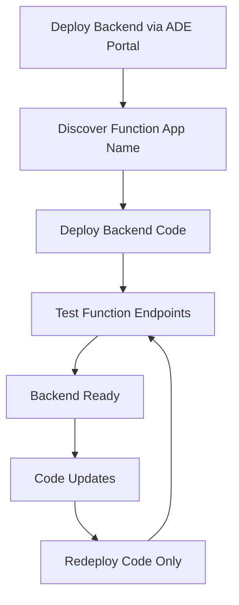

# Backend Azure Deployment Environment

## Overview

This Azure Deployment Environment (ADE) definition enables self-service deployment of the backend infrastructure for the AI Foundry SPA application through the Azure Portal. The backend consists of a serverless Function App that acts as a proxy between the frontend SPA and AI Foundry services, providing secure access with proper RBAC configuration.

## Architecture

The backend environment deploys:

- **Azure Function App**: Serverless compute for AI Foundry proxy service (FlexConsumption plan)
- **Storage Account**: Required for Function App runtime and state management
- **Application Insights**: Backend monitoring and analytics integration
- **RBAC Assignments**: Least privilege access to AI Foundry resources across resource groups
- **Cross-Resource Group Permissions**: Secure connectivity to existing AI Foundry and Log Analytics resources

## Parameters

### Required Parameters

These parameters **must** be provided when deploying through the ADE portal:

| Parameter | Description | Example |
|-----------|-------------|---------|
| `applicationName` | Name used for resource naming | `ai-foundry-spa` |
| `environmentName` | Environment identifier | `dev`, `staging`, `prod` |
| `location` | Azure region for deployment | `eastus2`, `centralus`, `westus2` |
| `aiFoundryInstanceName` | AI Foundry hub/project instance name | `ai-foundry-workspace-prod` |
| `aiFoundryResourceGroupName` | Resource Group containing AI Foundry | `rg-ai-foundry-prod` |
| `aiFoundryEndpoint` | AI Foundry endpoint URL | `https://ai-foundry.services.ai.azure.com/api/projects/myProject` |
| `aiFoundryAgentId` | AI Foundry agent ID | `asst_ABC123DEF456` |
| `logAnalyticsWorkspaceName` | Log Analytics Workspace name | `law-monitoring-prod` |
| `logAnalyticsResourceGroupName` | Resource Group containing Log Analytics | `rg-monitoring-shared` |

### Optional Parameters

These parameters have default values but can be customized:

| Parameter | Default | Description |
|-----------|---------|-------------|
| `aiFoundryAgentName` | `AI in A Box` | Display name for the AI Foundry agent |
| `adeName` | _(empty)_ | Name for the Azure Deployment Environment |
| `devCenterProjectName` | _(empty)_ | Name of the DevCenter project |
| `tags` | _(none)_ | Additional resource tags |

## Deployment Guide

### Step 1: Deploy Infrastructure via ADE Portal

1. Navigate to your Azure Deployment Environment
2. Select "Create Environment"
3. Choose the **AI_Foundry_SPA_Backend** catalog item
4. Fill in all required parameters
5. Review and deploy

### Step 2: Discover Resource Names

After successful deployment, identify the created resource names. Resources follow the naming pattern:
- Function App: `func-{applicationName}-backend-{environmentName}-{regionCode}`
- Resource Group: `rg-{applicationName}-backend-{environmentName}-{regionCode}`

### Step 3: Deploy Backend Code

Use the existing deployment script to deploy Function App code:

```powershell
# Deploy backend Function App code
./deploy-scripts/deploy-backend-func-code.ps1 `
  -FunctionAppName "func-ai-foundry-spa-backend-dev-eus2" `
  -ResourceGroupName "rg-ai-foundry-spa-backend-dev-eus2"
```

### Step 4: Verification

Test the deployed Function App endpoints:

```powershell
# Test Function App endpoints
./tests/Test-FunctionEndpoints.ps1 `
  -BaseUrl "https://func-ai-foundry-spa-backend-dev-eus2.azurewebsites.net"
```

## RBAC and Security

### Managed Identity

The Function App uses **system-assigned managed identity** with the following role assignments:

- **Azure AI Developer** role scoped to the specific AI Foundry resource
- **Monitoring Contributor** role scoped to the Log Analytics workspace (if needed)

### Cross-Resource Group Access

This deployment creates RBAC assignments across resource groups:
- Backend Function App (new resource group) → AI Foundry (existing resource group)
- Backend Function App (new resource group) → Log Analytics (existing resource group)

### Security Best Practices

- ✅ **Least Privilege**: Only assigns necessary permissions
- ✅ **Resource-Scoped**: RBAC assignments target specific resources, not resource groups
- ✅ **System-Assigned Identity**: No user-assigned identities to manage
- ✅ **Secure Communication**: All connections use managed identity authentication

## Integration with AI Foundry

### AI Foundry Configuration

The Function App requires these AI Foundry details:

- **Instance Name**: The name of your AI Foundry hub/project
- **Resource Group**: Where your AI Foundry resources are deployed
- **Endpoint URL**: The full API endpoint for your AI Foundry project
- **Agent ID**: The specific agent identifier to use

### Environment Variables

The deployment automatically configures these environment variables:

```
AI_FOUNDRY_ENDPOINT=<your-endpoint>
AI_FOUNDRY_WORKSPACE_NAME=<instance-name>
AI_FOUNDRY_AGENT_ID=<agent-id>
AI_FOUNDRY_AGENT_NAME=<agent-display-name>
```

## Post-Deployment Workflow

### Typical ADE Backend Workflow



### Code-Only Deployments

After initial infrastructure deployment via ADE, use the code deployment scripts for updates:

- **Function App Code**: Use `deploy-backend-func-code.ps1`
- **Configuration Updates**: Modify app settings through Azure Portal or ARM templates
- **RBAC Changes**: May require infrastructure redeployment through ADE

## Troubleshooting

### Common Issues

#### 1. RBAC Assignment Failures

**Symptom**: Deployment fails with permission errors
**Solution**: 
- Verify you have Owner or User Access Administrator role on the target AI Foundry resource
- Check that the AI Foundry resource exists in the specified resource group

#### 2. Function App Cold Start

**Symptom**: First requests to Function App are slow
**Solution**: 
- This is expected behavior for FlexConsumption plan
- Consider Always On setting for production workloads

#### 3. AI Foundry Connection Issues

**Symptom**: Function App cannot connect to AI Foundry
**Solution**:
- Verify the AI Foundry endpoint URL is correct and accessible
- Check that the managed identity has proper permissions
- Validate the agent ID exists in the AI Foundry project

#### 4. Log Analytics Integration

**Symptom**: No logs appearing in Log Analytics
**Solution**:
- Verify the Log Analytics workspace exists and is accessible
- Check Application Insights is properly configured
- Allow 5-10 minutes for initial log ingestion

### Debugging Steps

1. **Check Deployment Status**: Review ADE deployment logs in Azure Portal
2. **Verify Resources**: Confirm all resources were created successfully
3. **Test Managed Identity**: Use Azure CLI to test identity permissions
4. **Review Function Logs**: Check Function App logs in Azure Portal
5. **Validate Configuration**: Verify environment variables are set correctly

## Additional Resources

- [AI Foundry SPA Documentation](../../../documentation/)
- [Function App Development Guide](../../../src/backend/README.md)
- [RBAC Best Practices](../../../documentation/MULTI_RG_ARCHITECTURE.md)
- [Azure Deployment Environments Guide](../../../documentation/AZURE_DEPLOYMENT_ENVIRONMENTS.md)

## Next Steps

After successful backend deployment:

1. **Deploy Frontend**: Use the frontend ADE for complete application deployment
2. **Configure Monitoring**: Set up alerts and dashboards in Application Insights
3. **Production Readiness**: Review scaling, backup, and disaster recovery options
4. **CI/CD Integration**: Implement automated code deployments